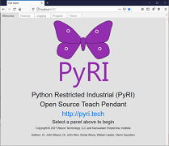
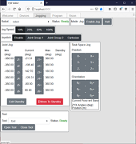
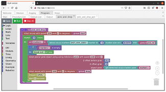
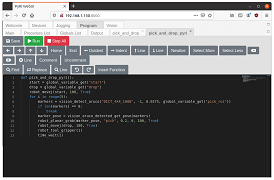
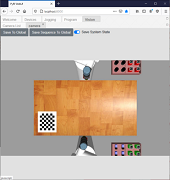
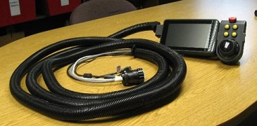

<p align="center">

</p>

# PyRI Open Source Teach Pendant Core Module

The Python Restricted Industrial (PyRI) Open Source Teach Pendant is designed to provide a simple, high-level programming environment for Open-Source ecosystems like Robot Raconteur and ROS. The objective is to allow engineers who are not software experts to access the powerful capabilities of these ecosystems. It provides a simple programming environment using Blockly, Restricted Python, and a top-level state machine. The Python Restricted Industrial Python dialect is a simplified subset of Python intended to be easier to use for novice programmers, to be more robust, and to be more verifiable than standard Python. This project also includes plans for a prototype teach pendant and runtime cabinet based on a Raspberry Pi, Surface Tablet, and NUC.

     

Get started with PyRI by installing from Conda. See [Conda Install](#conda-install). See [Documentation](#documentation) for the available documentation. It is highly recommended that the Robot Raconteur training simulator be installed and used to learn to use the software.

The PyRI software is designed to work with Robot Raconteur device drivers, and Robot Raconteur proxy services for ROS devices. See https://github.com/robotraconteur/robotraconteur-directory for a directory of available drivers.
## Conda Install

Conda is the easiest way to install PyRI. Begin by installing Anaconda or Miniconda with Python version 3.8. Once installed, run the following in a conda prompt to install PyRI:

```
conda create -n pyri -c conda-forge -c robotraconteur -c pyri-project pyri-robotics-superpack
```

Activate the new conda environment:

```
conda activate pyri
```

Now run PyRI:

```
pyri-core --db-file=my_project.db
```

Use Firefox or Chrome to open http://localhost:8000

The `pyri-robotics-superpack` Conda package includes the base teach pendant packages, `pyri-robotics`, and `pyri-vision`. It dose NOT include the Tesseract motion planner. See https://github.com/pyri-project/pyri-tesseract-planning/blob/master/README.md for installation instructions.

To install the training simulator, see https://github.com/robotraconteur-contrib/robotraconteur_training_sim/blob/master/README.md . It is highly recommended that the training simulator be used to learn the PyRI software.

## Documentation

* WebUI Interface Documentation: [InterfaceMenuDocumentation.md](doc/InterfaceMenuDocumentation.md)
* User Programming Guide: [user_programming_guide.md](doc/user_programming_guide.md)
* Teach Pendant Construction Instructions: [TeachPendantConstructionInstructions.md](doc/TeachPendantConstructionInstructions.md)

Blocks and Functions Reference:

* Standard Blockly Blocks: [standard_blocks.md](doc/standard_blocks.md)
* Util: [util_blocks_functions.md](doc/util_blocks_functions.md)
* Globals: [globals_blocks_functions.md](doc/globals_blocks_functions.md)
* Time: [time_blocks_functions.md](doc/time_blocks_functions.md)
* Linalg: [linalg_blocks_functions.md](doc/linalg_blocks_functions.md)
* Geometry: [geometry_blocks_functions.md](doc/geometry_blocks_functions.md)
* Robotics: [robot_blocks_functions.md](https://github.com/pyri-project/pyri-robotics/blob/master/doc/robot_blocks_functions.md)
* Vision: [vision_blocks_functions.md](https://github.com/pyri-project/pyri-vision/blob/master/doc/vision_blocks_functions.md)

Development Reference:

* Software Architecture: [pyri_software_architecture.md](doc/pyri_software_architecture.md)
* Development Environment Setup: [development_env_setup.md](doc/development_env_setup.md)
* Extension Development Guide: [plugin_development.md](doc/plugin_development.md)

## pyri-core Service

The `pyri-core` package contained in this repository contains the `pyri-core` service. This service is used to launch the other microservices that make up the teach pendant runtime. See [pyri_software_architecture.md](doc/pyri_software_architecture.md) for more information on how this works.

Command line example:

    pyri-core --db-file=my_project.db

Command line arguments:

| Option | Type | Required | Description |
| ---    | ---  | ---      | ---         |
| `--db-file=` | File | Either `--db-file` or `--db-url` | The file to store the user database in using SQLite format |
| `--db-url=`  | SQLAlchemy URL | Either `--db-file` or `--db-url` | The SQLAlchemy URL of the database to use |
| `--no-add-default-devices` | Flag | No | Disable adding default devices to a new project database |

The database file to store the user program must be specified as `--db-file` or `--db-url`. The `--db-url` option can use an arbitrary database supported by SQLAlchemy. Other extension packages may add additional command line options to `pyri-core`. Check the documentation for each package for more information.

## PyRI Packages

PyRI currently consists of the following packages:

* `pyri-common`: https://github.com/pyri-project/pyri-common
* `pyri-variable-storage`: https://github.com/pyri-project/pyri-variable-storage
* `pyri-device-manager`: https://github.com/pyri-project/pyri-device-manager
* `pyri-devices-states`: https://github.com/pyri-project/pyri-devices-states
* `pyri-sandbox`: https://github.com/pyri-project/pyri-sandbox
* `pyri-webui-server`: https://github.com/pyri-project/pyri-webui-server
* `pyri-webui-browser`: https://github.com/pyri-project/pyri-webui-browser
* `pyri-core`: https://github.com/pyri-project/pyri-core
* `pyri-program-master`: https://github.com/pyri-project/pyri-program-master

Optional packages

* `pyri-robotics`: https://github.com/pyri-project/pyri-robotics
* `pyri-robotics-browser`: https://github.com/pyri-project/pyri-robotics-browser
* `pyri-vision`: https://github.com/pyri-project/pyri-vision
* `pyri-vision-browser`: https://github.com/pyri-project/pyri-vision-browser
* `pyri-tesseract-planning`: https://github.com/pyri-project/pyri-tesseract-planning
* `pyri-tesseract-planning-browser`: https://github.com/pyri-project/pyri-tesseract-planning-browser

Additional developer tools:

* `pyri-example-plugin`: https://github.com/pyri-project/pyri-example-plugin
* `pyri-scripts`: https://github.com/johnwason/pyri-scripts (development scripts and examples to trial components)

Teach Pendant Device:

* CAD files and drawings: https://github.com/pyri-project/pyri-teach-pendant-device

## Acknowledgment

This work was supported in part by Subaward No. ARM-TEC-19-01-F-24 from the Advanced Robotics for Manufacturing ("ARM") Institute under Agreement Number W911NF-17-3-0004 sponsored by the Office of the Secretary of Defense. ARM Project Management was provided by Christopher Adams. The views and conclusions contained in this document are those of the authors and should not be interpreted as representing the official policies, either expressed or implied, of either ARM or the Office of the Secretary of Defense of the U.S. Government. The U.S. Government is authorized to reproduce and distribute reprints for Government purposes, notwithstanding any copyright notation herein.

This work was supported in part by the New York State Empire State Development Division of Science, Technology and Innovation (NYSTAR) under contract C160142. 

 

PyRI is developed by Rensselaer Polytechnic Institute, Wason Technology, LLC, and contributors.
