# Pyri Interface Menu Documentation

## ARM 19-01 F-24

## 1.0: Devices Menu

The devices menu provides all the elements required to connect to devices in this system. On loading, the devices menu will show all active devices connected to the system. The view
of the devices can be toggled using the "Show card view" button at the upper right, adjacent to the search menu. Table View can be seen in Figure 1 below and Card View can be seen in Figure 2.

<figure>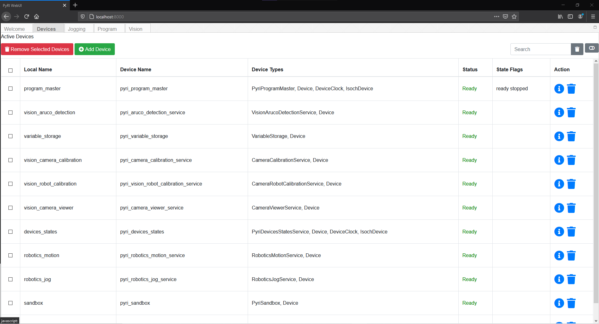<figcaption>Figure 1: Device Menu in Table View Mode</figcaption></figure>

<figure>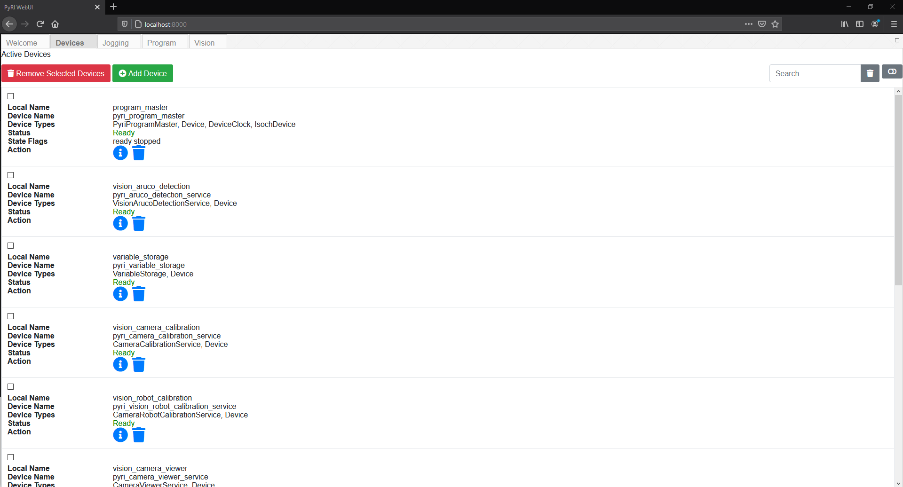<figcaption>Figure 2: Device Menu in Card View Mode</figcaption></figure>

Each device in the menu has a local name that you specify when you add the device into the system, this is the name that can be used to refer to the device in other sections of the UI, such as in the Blockly code. It also has its own Device Name that the UI obtains from the service itself along with its Device Type, which is the unqualified name of the RR service type that the device has. The entry also displays the current connection Status of the device. The status can be either Ready, Connected or Error, with Connected specifying an active connection to a device or robot that has not yet been enabled. For additional information on the device you can press the Blue I icon under Actions.
Additional features of this menu include the ability to search for desired devices using the search menu in the upper right and also select multiple devices and delete them using the "Remove Selected Devices" button in the upper left. Individual services can also be deleted using the Trash can icon under that device's Actions. In the Table view of the devices there is also a State Flags field that displays flags based on feedback from the service interface, the individual flags that can be displayed and their meanings are described in the Pyri Plugin Adapter for that specific Device Type. Device Flags are not necessarily errors but they can be.
To add a new device into the system you press the green "Add Device" button. This will open the interface shown in Figure 3. This menu features a list of all Robot Raconteur visible device services using service discovery. The view of visible services can be refreshed with the "Refresh" button at the top left. This menu gives you all the appropriate information to verify the service you are connecting to is the correct one. To add the service, simply press the blue + icon listed under Actions. This will open up a prompt, shown in Figure 4, asking you to specify a unique Local Device Name to give the device that other parts of the interface can use to refer to the device. If an error occurs when trying to add the device a window will open displaying the error. If successful the device will then be visible in the device menu.

<figure>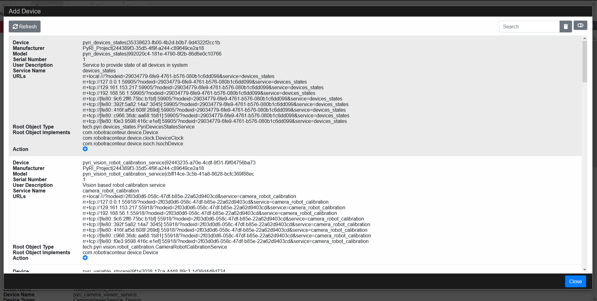<figcaption>Figure 3: Add Device Menu</figcaption></figure>

<figure>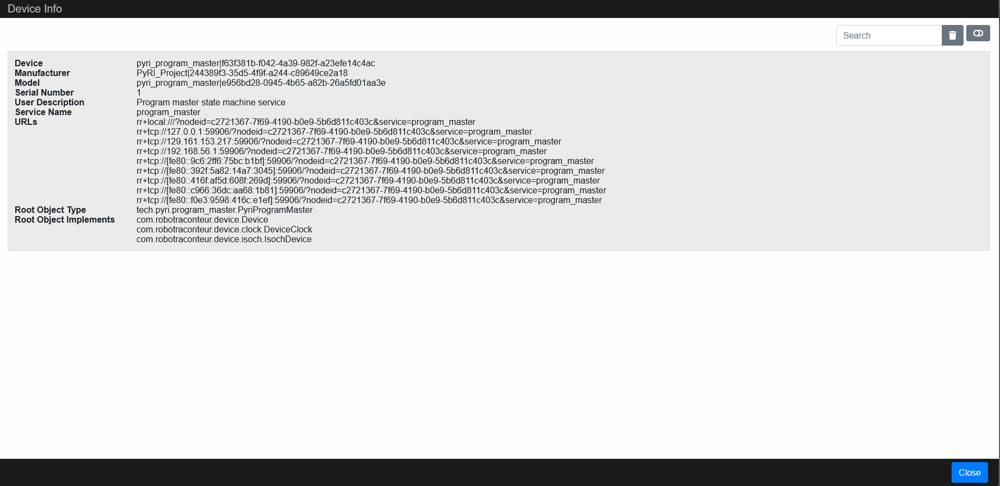<figcaption>Figure 4: Device Info Popup</figcaption></figure>

<figure>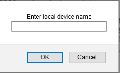<figcaption>Figure 5: Enter Local Device Name Prompt</figcaption></figure>

There are also a number of devices loaded by default which provide important functionality for the system. These devices include the following:
<table>
  <tr>
   <td>Default Devices
   </td>
   <td>Description
    </td>
  </tr>
  <tr>
   <td>program_master
   </td>
   <td>executes procedures in python or blockly, stateless
   </td>
   
  </tr>
  <tr>
   <td>device_states
   </td>
   <td>aggregates data from other devices and provides wire of state information to gui at 10 hz update rate for all data to gui
   </td>
   
  </tr>
    <tr>
   <td>robotics_motion
   </td>
   <td>manages commanding robots from programmed motions/trajectories, outputs motion commands to the robot RR interface
   </td>
   
  </tr>
    <tr>
   <td>robotics_jog
   </td>
   <td>manages commanding robots with user commanded jog motions, outputs commands to the robot RR interface
   </td>
   
  </tr>
    <tr>
   <td>variable_storage
   </td>
   <td>keeps track of all variables, device data, any persistent data, also functions as a save for the program, stores this data in an sqlite file
   </td>
   
  </tr>
</table>

## 2.0: Jogging Menu

The Jogging Menu allows the operator to select robots to jog and move around as well as actuate defined tools. On system start the Jogging Menu will appear as shown in Figure 6. To connect to an added Robot Device, simply press on the drop-down Robot menu in the upper left of the screen. The status indicator should then change to Halt. You can then press the "Enable Jog" mode and the status indicator should change to Ready as shown in Figure 7. You can also select a tool to connect to in a similar manner, but with tools you can normally only open or close them using the appropriate buttons. There are a variety of jogging modes available, and joint angles are presented along with their maximum ranges. The robot can also be jogged in cartesian using the Task Space Jog menu, the position is usually calculated relative to the base of the robot for this. 

<figure>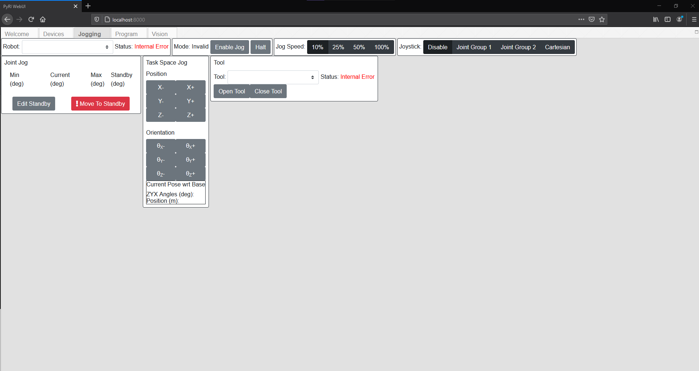<figcaption>Figure 6: Jogging Menu Shown without Connected Robot</figcaption></figure>

<figure>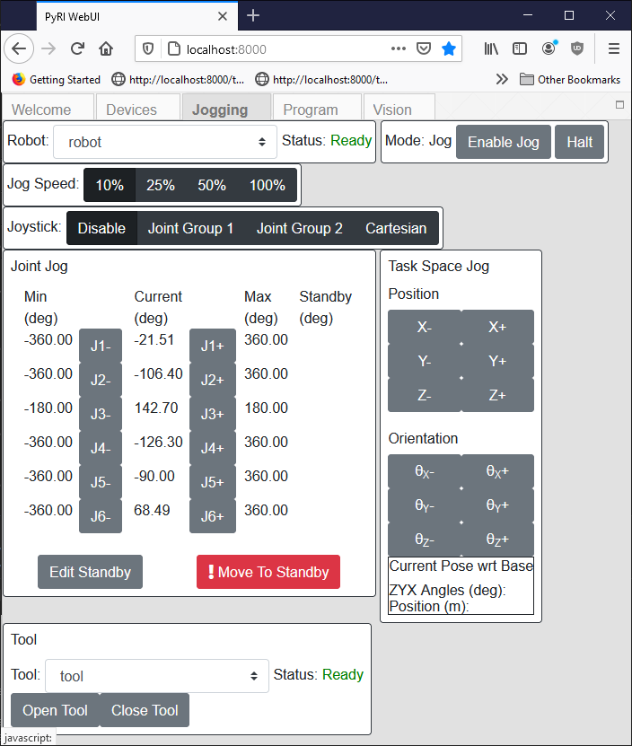<figcaption>Figure 7: Jogging Menu Shown with Connected Robot</figcaption></figure>

Taught points can also be implemented in the jogging menu by using the "Edit Standby" button. This button opens up the "Joint Angle Standby Editor" pop-up window as shown in Figure 8 below. This window allows you to specify a standby pose that functions like a robot home, which can be easily returned to by using the "Move to Standby" button on the Jog Screen. The Standby pose defaults to all 0 joint angles, but can be changed by pressing the "Set Standby to Current" button. Make sure that the angles have been set correctly before moving to standby otherwise unexpected robot motions could occur. In addition to the standby pose, other poses can be saved by pressing "Save Standby Joint Pose" which saves the current pose to a name that you specify in a pop-up. this pose is then created as a Global Variable in the system and can be viewed under the Programs tab in the Globals List window. These function like taught points and can be referred to by name in the code of the system. Created points should show up in the Joint Angle Specifier Menu where they can be loaded and then moved to. 

<figure>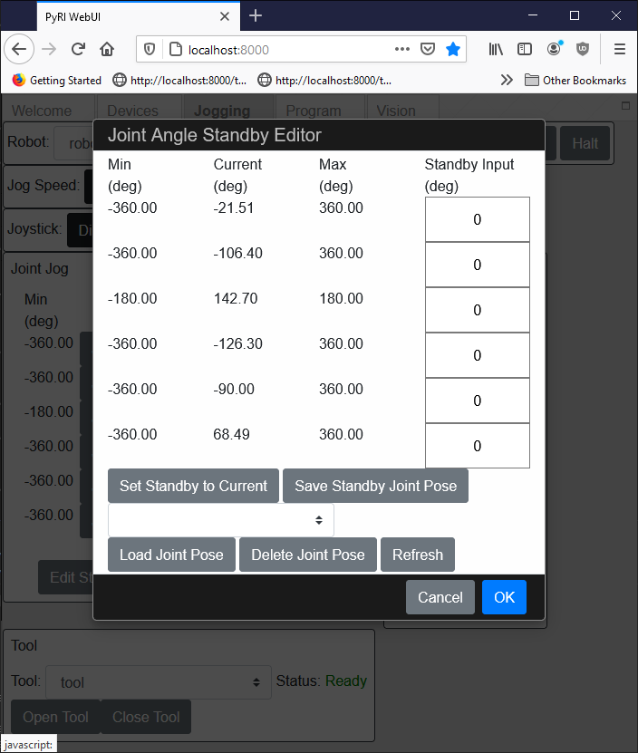<figcaption>Figure 8: Joint Angle Specifier Menu</figcaption></figure>

In addition to the buttons, a joystick input can be used to jog the robot. This is done using the Joystick selecting buttons, these function by mapping the joystick inputs to robot joints by group. By selecting Joint Group 1, the joystick inputs are mapped so that linear x inputs on the joystick controls robot joint 1, linear y controls joint 2, linear z controls joint 3, and if the robot is a 7 DOF robot then twist z controls joint 4. The same basic scheme applies for selecting Joint Group 2, with linear x controlling robot joint 4 in 6 DOF robots and joint 5 in 7 DOF and so on for the remainder of the joints. The speed of the Jog can also be set as a value relative to the robot's normal jogging velocity.

## 3.0: Program Menu

<figure>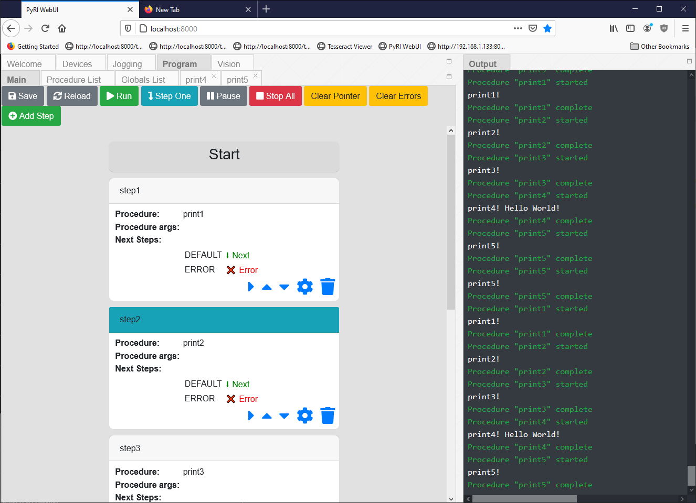<figcaption>Figure 9: Program Menu Main Run Screen</figcaption></figure>

<figure>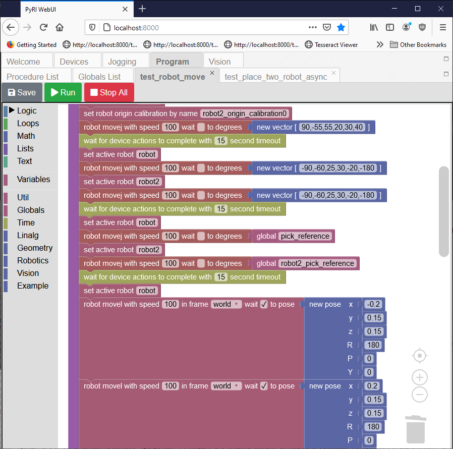<figcaption>Figure 10: Example Blockly Script in Program List</figcaption></figure>

<figure>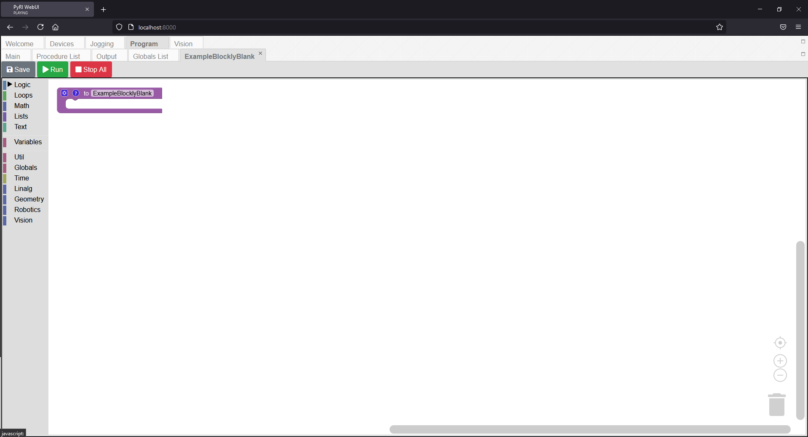<figcaption>Figure 11: Example Empty Blockly Script</figcaption></figure>

<figure>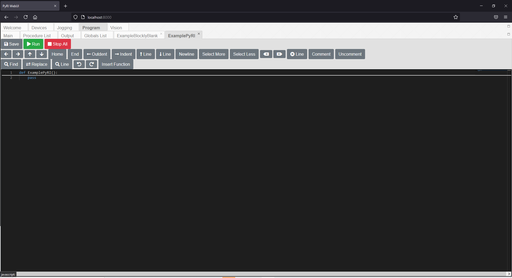<figcaption>Figure 11: Example Empty PyRI Script</figcaption></figure>

