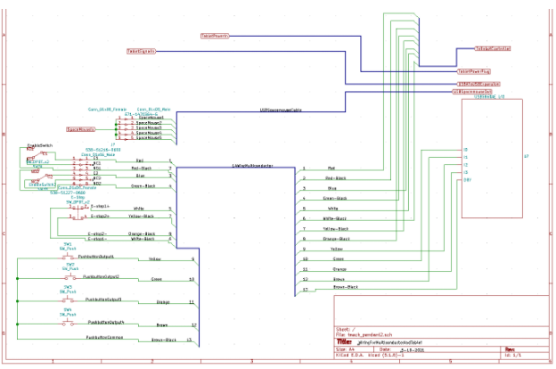

# Pyri Interface Menu Documentation

## ARM 19-01 F-24

## 1.0: Devices Menu

The devices menu provides all the elements required to connect to devices in this system. On loading, the devices menu will show all active devices connected to the system. The view
of the devices can be toggled using the "Show card view" button at the upper right, adjacent to the search menu. Table View can be seen in Figure 1 below and Card View can be seen in Figure 2.

<figure><figcaption>Figure 1: Device Menu in Table View Mode</figcaption></figure>

<figure><figcaption>Figure 2: Device Menu in Card View Mode</figcaption></figure>

<figure><figcaption>Figure 3: Wiring Diagram of Teach Pendant IO Module</figcaption></figure>
