# Open Source Smart Teach Pendant Assembly Instructions

## ARM 19-01 F-24

# 1.0: IO Module Assembly

  

## 1.1 Printing Parts

  
Using a 3D printer you should print the following 3 parts:
  
Top plate:
  
https://drive.google.com/file/d/1IYWB5CsFkGXZQp9TxbVLHba8R_g6lPkX/view?usp=sharing
  
Back plate:  

https://drive.google.com/file/d/1IaDCZnAihkgH-hdGimJF-svArH_wETXU/view?usp=sharing
  
Grip:  

https://drive.google.com/file/d/1i82ImHI7c54tlWe4a6V1f5gUL85zPm06/view?usp=sharing
  

## 1.2 Disassembly of Space Mouse

Follow instructions here to disassemble Space Mouse:  

[https://www.youtube.com/watch?v=D6GJGMwMN0A](https://www.youtube.com/watch?v=D6GJGMwMN0A)
  

## 1.3 Assembly of Components and Wiring

For the cable, the teach pendant side of the multi conductor cable should be stripped for about 3-4 inches, the wire pairs should be kept together to help identify which black wires are associated with which colors. 

   

After the multi conductor cable has been prepared, the 4 push buttons should be installed into the printed top plate of the teach pendant by unscrewing the metal nut on the bottom of the push button, inserting the push button screw end first into the top of the top plate. Then screw the metal nut back on making sure to keep the rubber grommet on.The innermost of the two leads of each push button should then be soldered together in a chain so that all 4 are connected, one of the buttons should then have the brown-black wire from the multiconductor soldered on to create the common ground for the buttons. Then the following wires from the multi conductor should be soldered directly onto the other lead on the following buttons, yellow to button 1, brown to button 2, orange to button 3, green to button 4, with the buttons being numbered as shown in Figure 1:
  
Push Button Wiring:

  
<table>
  <tr>
   <td>Signal Name
   </td>
   <td>Wire Color
   </td>
   <td>Panel Connector Pin #
   </td>
  </tr>
  <tr>
   <td>Push Button 1+
   </td>
   <td>Yellow
   </td>
   <td>9
   </td>
  </tr>
  <tr>
   <td>Push Button 2+
   </td>
   <td>Green
   </td>
   <td>10
   </td>
  </tr>
  <tr>
   <td>Push Button 3+
   </td>
   <td>Orange
   </td>
   <td>11
   </td>
  </tr>
  <tr>
   <td>Push Button 4+
   </td>
   <td>Brown
   </td>
   <td>12
   </td>
  </tr>
  <tr>
   <td>Push Button Common Gnd
   </td>
   <td>Brown-Black
   </td>
   <td>13
   </td>
  </tr>
</table>

  

<figure>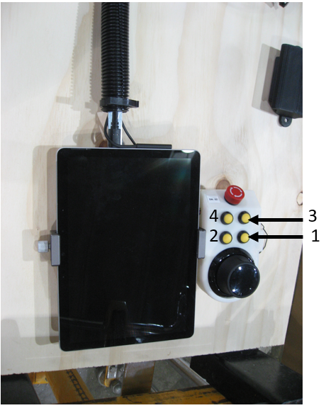<figcaption>Figure 1: Button Labeled Assembled Teach Pendant</figcaption></figure>

  

<figure>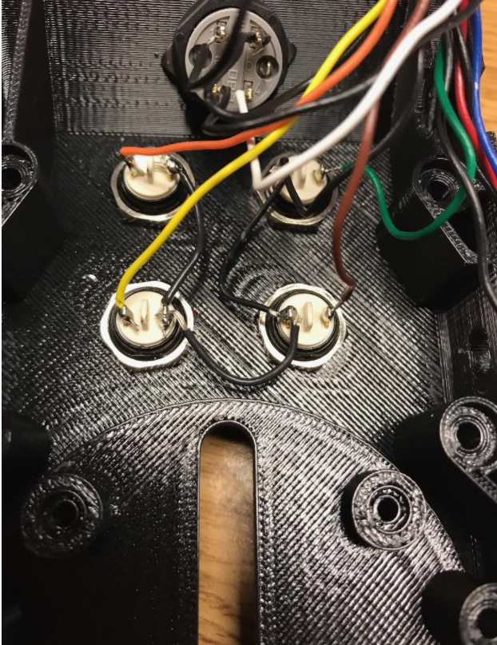<figcaption>Figure 2: View of Push Button Wiring</figcaption></figure>

  

<figure>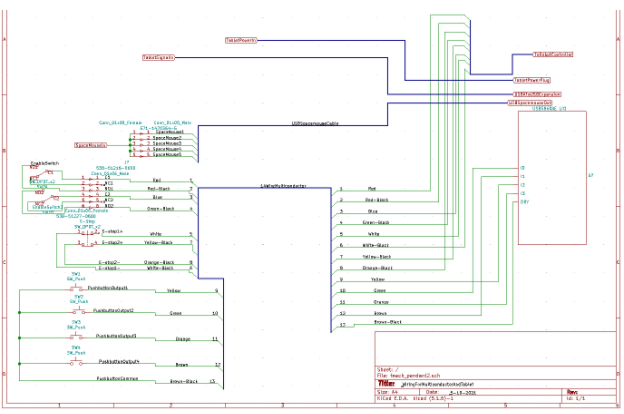<figcaption>Figure 3: Wiring Diagram of Teach Pendant IO Module</figcaption></figure>

  

After the push buttons have been wired the E-Stop should be attached by first unscrewing the plastic nut and removing the metal mounting part, the E-Stop should then be inserted so the button faces out of the teach pendant, the metal mounting part  is put back on first and then screwed down using the plastic nut so that the E-Stop is secure against the plastic. You then solder the following wires onto the following numbered pins on the E-Stop: Pin 1->yellow-black wire, Pin 2-> white-black wire, Pin 3->brown-black wire, Pin 4-> white wire.
  
E-Stop Wiring:
  

<table>
  <tr>
   <td>Signal Name
   </td>
   <td>Wire Color
   </td>
   <td>Panel Connector Pin #
   </td>
  </tr>
  <tr>
   <td>E-Stop 1+
   </td>
   <td>White
   </td>
   <td>5
   </td>
  </tr>
  <tr>
   <td>E-Stop 1-
   </td>
   <td>White-Black
   </td>
   <td>6
   </td>
  </tr>
  <tr>
   <td>E-Stop 2+
   </td>
   <td>Yellow-Black
   </td>
   <td>7
   </td>
  </tr>
  <tr>
   <td>E-Stop 2-
   </td>
   <td>Orange-Black
   </td>
   <td>8
   </td>
  </tr>
</table>

  

<figure>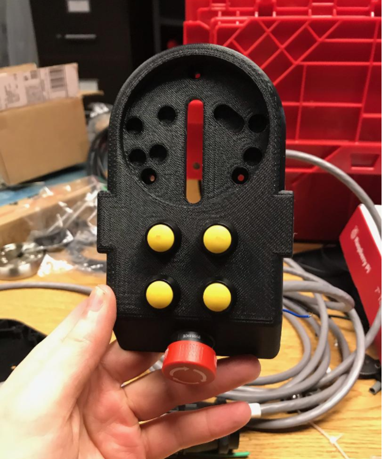<figcaption>Figure 4: View of Teach Pendant with attached Push buttons and E-Stop</figcaption></figure>

  

The following wires should then be crimped into male connector pins, the blue wire, the green-black wire, the red wire and the red-black wire. Before these wires are inserted in the connector, they must be threaded through the hole in the back plate, being careful to thread one at a time to prevent jamming them into the hole and damaging the pins. These pins are then inserted into the matching 6-pin male connector such that green-black wire is inserted in position 1, blue is inserted in position 3, red in position 4 and red-black into position 6.
  
Enable Wiring:
  

<table>
  <tr>
   <td>Signal Name
   </td>
   <td>Wire Color
   </td>
   <td>Panel Connector Pin #
   </td>
  </tr>
  <tr>
   <td>Enable 1+
   </td>
   <td>Red
   </td>
   <td>1
   </td>
  </tr>
  <tr>
   <td>Enable 1-
   </td>
   <td>Red-Black
   </td>
   <td>2
   </td>
  </tr>
  <tr>
   <td>Enable 2+
   </td>
   <td>Blue
   </td>
   <td>3
   </td>
  </tr>
  <tr>
   <td>Enable 2-
   </td>
   <td>Green-Black
   </td>
   <td>4
   </td>
  </tr>
</table>
  

The enable button should then have 4 wires soldered to it, ideally 2 red wires should be soldered to the C1 and C2 pin of the enable switch, then 2 black wires should be soldered to the NO1 and NO2 pins. Female connector pins should then be crimped onto the opposite ends of the 4 wires. The wire connected to NO1 should then be inserted into position 1 of the matching 6-pin female connector, C1 should be inserted into position 3, C2 into position 4, and NO2 should be inserted into position 6. After this the rubber side of the enable switch around the screw holes should be peeled back to insert screw nuts in to mount the enable switch into the 3D printed part for the grip. Using a hex head screw, the matching screw should be screwed in so that the enable is firmly mounted into the 3D printed grip. 
  

<figure>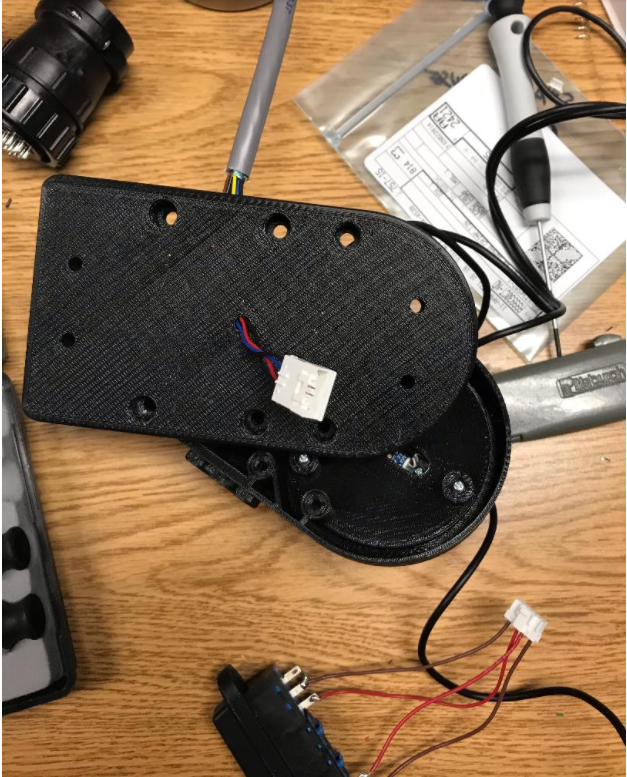<figcaption>Figure 5: View of Wired Teach Pendant with Enable Connector</figcaption></figure>

  

The space mouse should then be screwed into the top plate with the three screws used to mount the metal plate onto the space mouse. The wire from the space mouse should then be reconnected. The last step is to screw the hexhead screw into the tablet mount by placing the screw into the top plate side with the wires exiting it and put the tablet clamp on the outside of the top plate and screw the hexhead in to secure it. The top plate is then ready to be secured to the back plate. First move the multi conductor cable and the spacemouse cable to line up with the wire outlet hole and then hold the parts together firmly as the 6 screws are screwed from the back plate into the top plate so that the assembly feels solid. The connector to the enable button can then be connected and tucked into the grip assembly before screwing on the grip part as well. 
  

# 2.0: Wire Management

  

## 2.1 Multi conductor Cable Control Box End Wiring

For the portion of the multi conductor cable connecting to the cabinet, first the strain reliefs should be put onto the length of the multi conductor cable first and allowed to remain free further down the wire. After that two or three layers of shrink wrap should be applied of about 2 inch lengths approximately 1-1.5 inches before the point at which the cable is stripped.  Each wire is then crimped onto a male connector pin. Once all wires have been crimped the wires should be inserted into the male connector in the following order:
  

1: Red

2: Red-Black

3: Blue

4: Green-Black

5: White

6: White-Black

7: Yellow-Black

8: Orange-Black

9: Yellow

10: Green

11: Orange

12: Brown

13: Brown-Black

14: Blue-Black

With the Blue-Black being an optional spare connection.

  

<figure>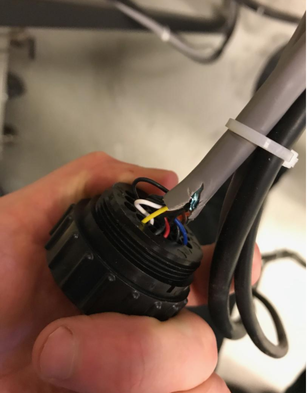<figcaption>Figure 6: Multiconductor Cable before Strain Relief is Attached (shown without heat shrink)</figcaption></figure>

  

Once all the pins are in the connector the strain relief should be secured to the wire using the largest insert which should be screwed down tightly over the portion of the wire with shrink wrap over it. The connector can then be screwed onto the strain relief portion. The multi conductor cable has now been fully assembled.

  

## 2.2 Teach Pendant Side Wiring Management

To handle the wiring attached to the teach pendant, a metal bracket should be bolted onto the back of the clamp attached to the teach pendant IO module as shown in Figure 7. A 3D printed wire clip made to gather all the wires from the pendant should then be attached to the bracket as shown in Figure 8.  A second set of 3D printed wire clips is then placed on the end near the runtime cabinet. Wire wrap is then put on to the cables going all the way to the cabinet wiring and wrapped around both 3D printed parts.A clamp is then placed on both sides of the cable to attach the wire wrap firmly to the 3D printed parts firmly. The teach pendant cabling is now fully assembled and ready to be wired into the runtime cabinet.

  

<figure>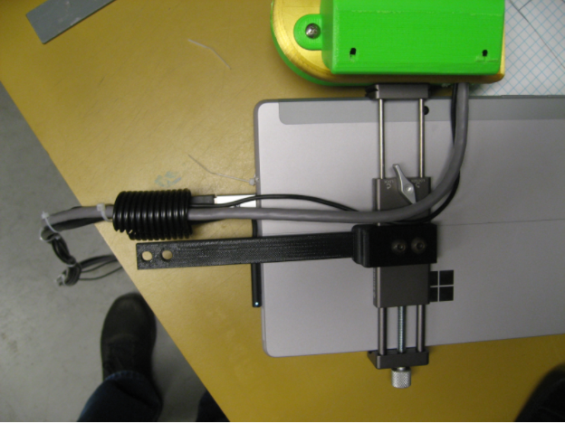<figcaption>Figure 7: Attachment of bracket and cable management</figcaption></figure>

  

<figure>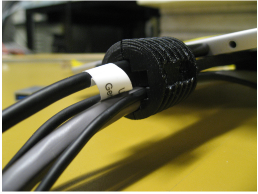<figcaption>Figure 8: Wire management Clip Assembly</figcaption></figure>

  

# 3.0: Runtime Cabinet Assembly

  

## 3.1 Cabinet Assembly

The assembly of the runtime cabinet begins with the assembly of the aluminum casing, sketches of the box can be found in the repository. And images showing its construction are also present to help in reconstructing the cabinet. The wiring diagram for the cabinet is also included and details the various electrical connections in the box. Ultimately the cabinet serves to house the runtime computer and take in signals from the teach pendant and either pass them on to the robot’s safety signals or process them itself. 

  

<figure>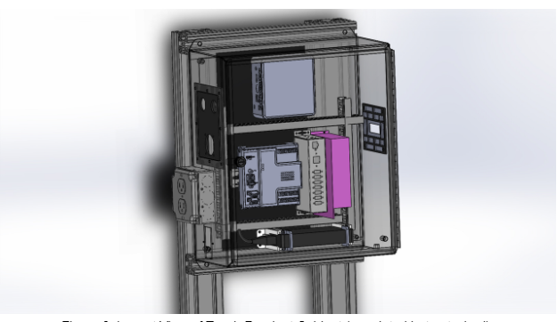<figcaption>Figure 9: Layout View of Teach Pendant Cabinet (populated but not wired)</figcaption></figure>

  

<figure>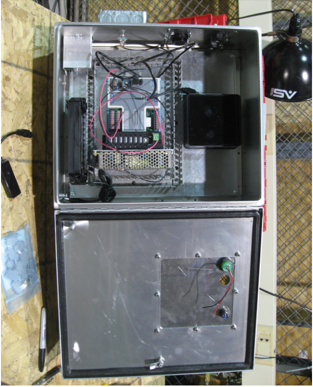<figcaption>Figure 10: Partially Populated view of Runtime Cabinet</figcaption></figure>

  

## 3.2 Wiring NUC Headers

To wire the NUC so that it can be powered on from the Runtime Power Button and so that it can display its operation via the Runtime Status LED you first need to unscrew the bottom of the NUC from the 4 screws located on the underside. Once you have removed the bottom, use the following wiring diagram to attach the 1mm header pins to. The wires going to the Runtime Power Button should be connected to pins 6 and 8. The positive end of the LED should be wired to Pin 4 and the negative end to 2 as shown below. To exit the wires from the NUC, thread the four wires one at a time through the hole meant for locking the NUC onto a surface. The hole exists on both the upper and lower portions of the case so you must thread it through both parts. As you go to close the case carefully pull the wires out as you move those portions together. Be warned this will make reopening the NUC difficult. You can then screw the bottom of the NUC case to the top. Cut the end of the header off and solder connections to it to the appropriate places, making sure the cables to the opening are long enough to let the box open and close without issue. 

  

<figure>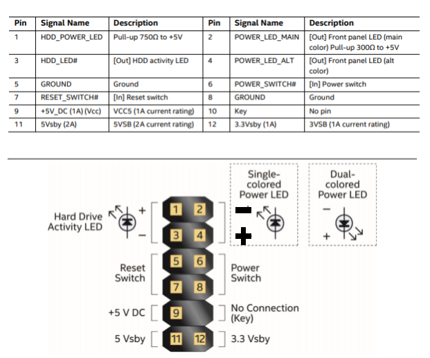<figcaption>Figure 11: Wiring Documentation for NUC Header Pins</figcaption></figure>

  

<figure><figcaption>Figure 12: View of NUC Casing with Designated Hole for Threading Wires from Header Pins</figcaption></figure>

  

<figure>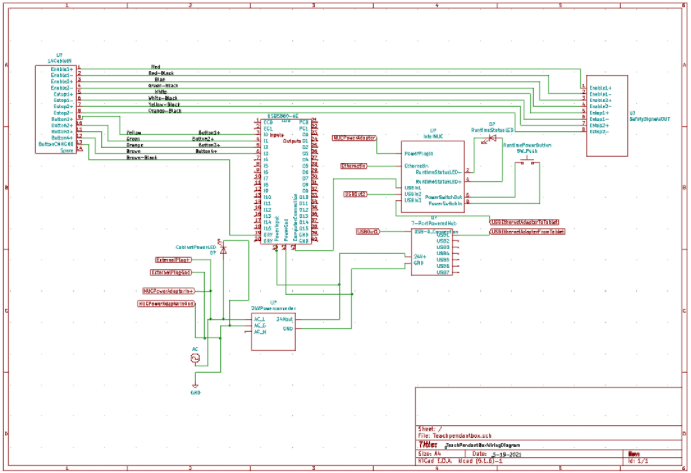<figcaption>Figure 13: Wiring Diagram of Runtime Cabinet</figcaption></figure>

  

# 4.0: Raspberry Pi Teach Pendant Version Assembly

  

## 4.1 Assembling the Screen

Before assembling the Raspberry Pi Teach Pendant you might want to initialize the Pi and install the recommended software for the teach pendant using a monitor and keyboard with an appropriately sized SD card inserted.To assemble the Raspberry Pi Teach Pendant, you first need to attach the Raspberry Pi to the screen. To do this you need to connect 2 wires from the Rasberry Pi I/O pins to the power input pins on the screen so the screen can draw power from the Pi. Due to space constraints you should take the 2 standard 2mm header cables and take off the plastic of one head, bend the pin near the top so that it forms a right angle, and heatshrink the end. Alternatively you can buy angled header connectors. Put the bent end on the Pi side, one cable should go to 5V power the other should go to Ground, use the following Raspberry Pi pinout to select the correct pins. Then insert the other end onto the matching labeled pins available on the Raspberry Pi Touch Screen board. Then attach the white ribbon cable into the touch screen connector on the Touch Screen board and then into the matching connector labeled “Display” on the Pi. Screw the offsets into the Touch Screen board and attach the Raspberry Pi with the majority of components facing down towards the Touch Screen. 

  

<figure>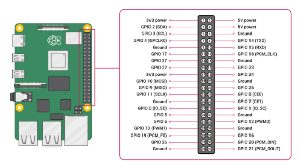<figcaption>Figure 14: Raspberry Pi Pinout Diagram</figcaption></figure>

  

<figure>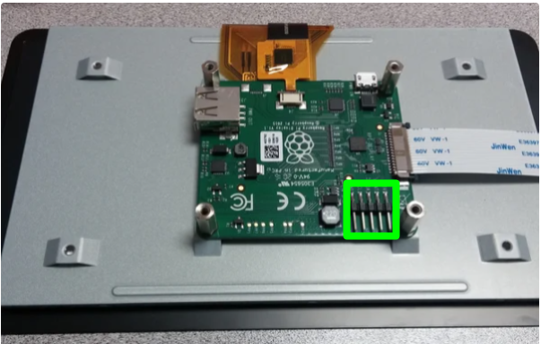<figcaption>Figure 15: Raspberry Pi Touchscreen Pinout Location</figcaption></figure>

  

<figure>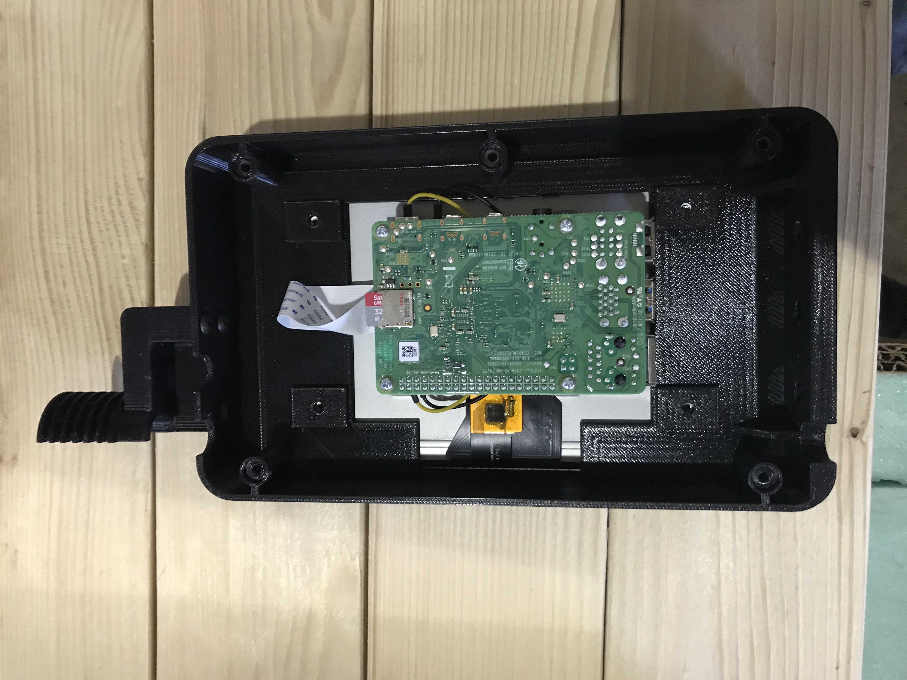<figcaption>Figure 16: Raspberry Pi and Touch Screen Initially Placed in 3D Printed Enclosure</figcaption></figure>

  

## 4.2 Assembly of Outer Casing

	Once the Pi is attached to the Touch Screen you can slide the touchscreen into the front face of the Raspberry Pi front plate piece as shown in Figure 16. There are 4 screw holes to attach the touchscreen to the case then. Screw it in firmly. Next there is a black metal mounting piece that must be screwed to the side of the case using the two outermost screw holes as shown in Figure 17. This allows the mounting of the I/O module securely.

  
<figure>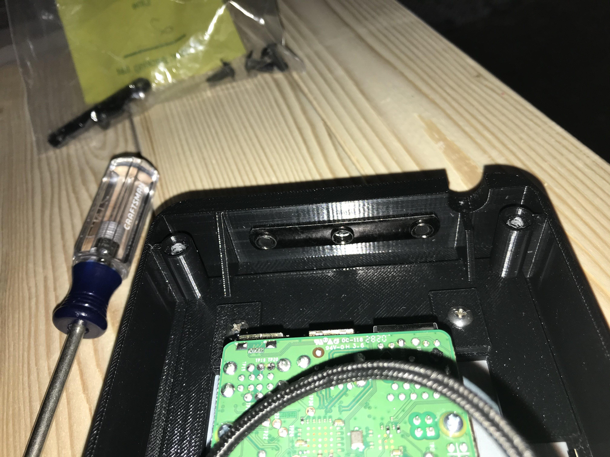<figcaption>Figure 17: Placement of Metal Mounting Plate in 3D Printed Base</figcaption></figure>

  

<figure>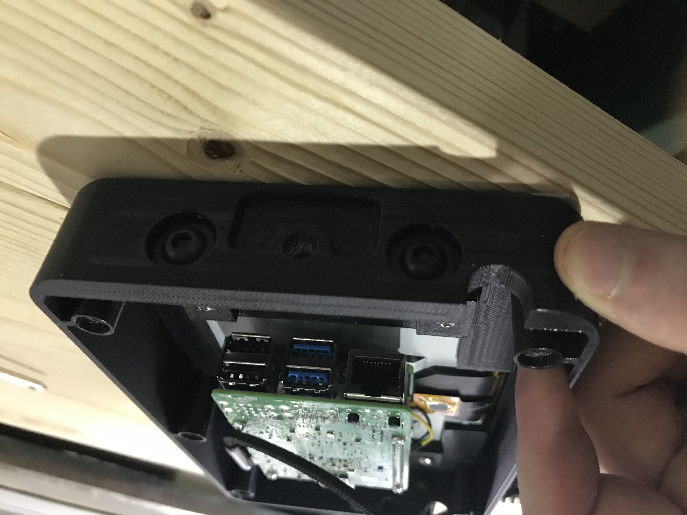<figcaption>Figure 18: View of Mounting Location for IO Module to Raspberry Pi Teach Pendant Module</figcaption></figure>

  

Next, the cables should be attached, for ease of assembly you may wish to attach the USB I/O cable before inserting the Pi and Touchscreen into the case, you may need to bend the cable while inserting, be careful. Attach the USB I/O cable to the USB 2 or 3 ports and the USB-C right angled connector into the USB- C power port as shown below. Try to make sure that you don’t plug the USB I/O cable into a port that is too close to the mounting hole for the I/O module.

  
<figure>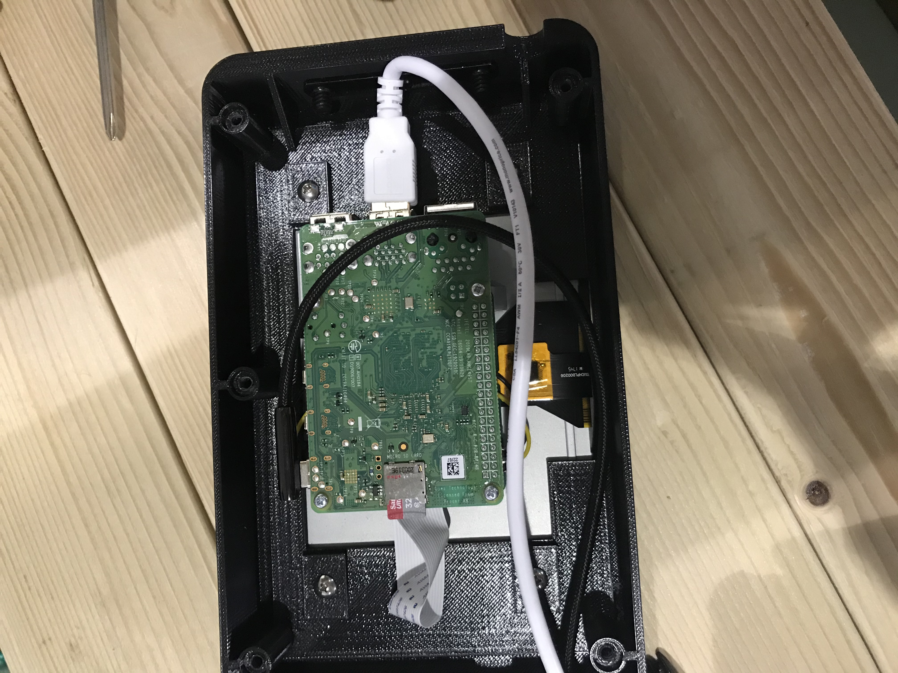<figcaption>Figure 19: Raspberry Pi with USB cables Inserted</figcaption></figure>

  

<figure>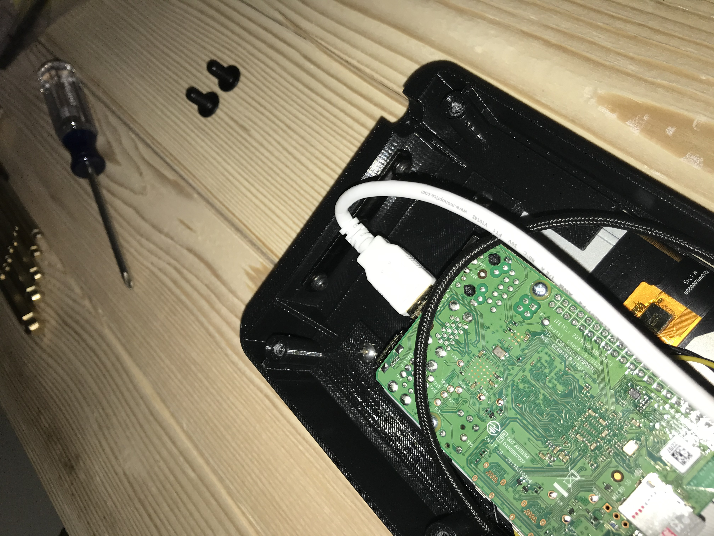<figcaption>Figure 20: USB cables Inserted into Raspberry Pi Second View</figcaption></figure>

  

## 4.3 I/O Module Attachment and Internal Wire Management

To Attach the I/O module, simply press it into the fitted slot and insert the screw. Before you close the I/O module, line up the Spacemouse cable and the multi conductor cable to the wire output hole and put the wires through the entire assembly to the cable output on the opposite side. Zip tie the cables together, especially focusing on places right before an exit hole. Use either of the two wiring holes at the bottom of the Touchscreen case to exit the 4 wires. You can then close the I/O module and screw it together. Then screw the enable button on as usual. You can now screw on the back of the Touchscreen case with the 5 screws.

  

<figure>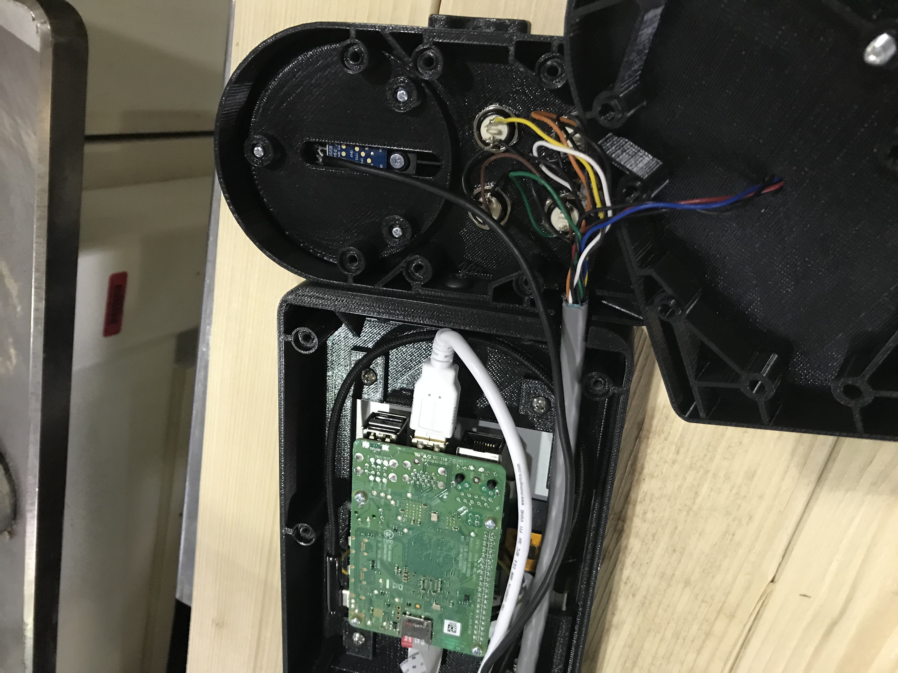<figcaption>Figure 21: Wiring pass Through for IO Module in Raspberry Pi Teach Pendant</figcaption></figure>

  

<figure>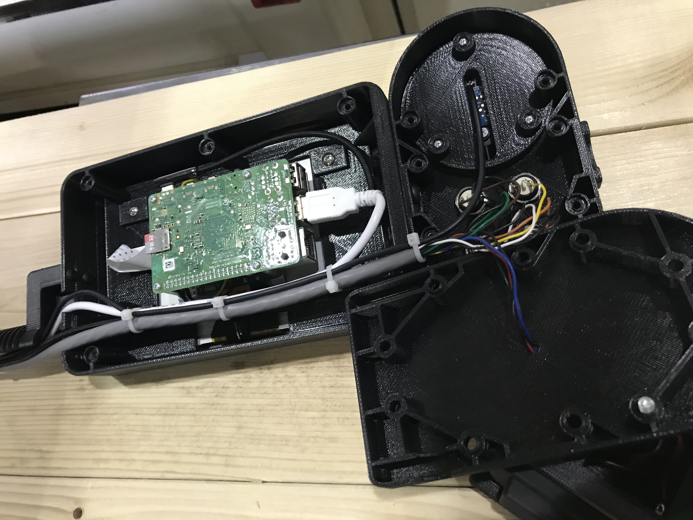<figcaption>Figure 22: Zip Tied wires in Interior of Raspberry Pi Teach Pendant</figcaption></figure>

  

<figure>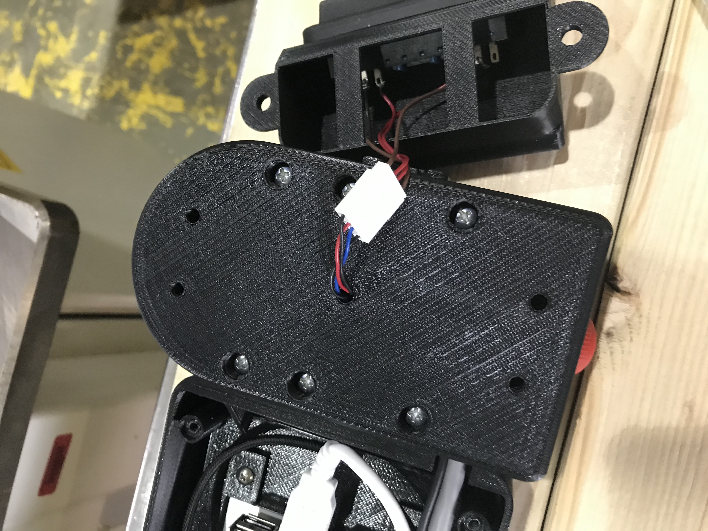<figcaption>Figure 23: Closed IO Module Before Attachment of Enable Button</figcaption></figure>

  

<figure>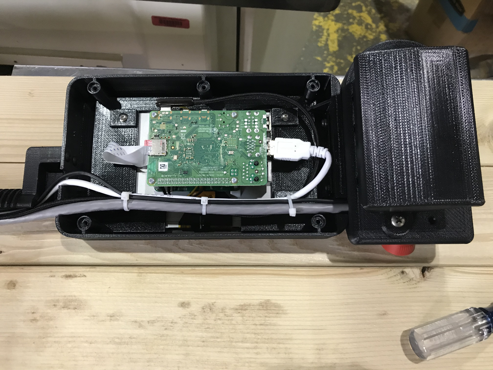<figcaption>Figure 24: Fully Assembled IO Module Attached To Raspberry Pi Teach Pendant Module</figcaption></figure>

  

<figure>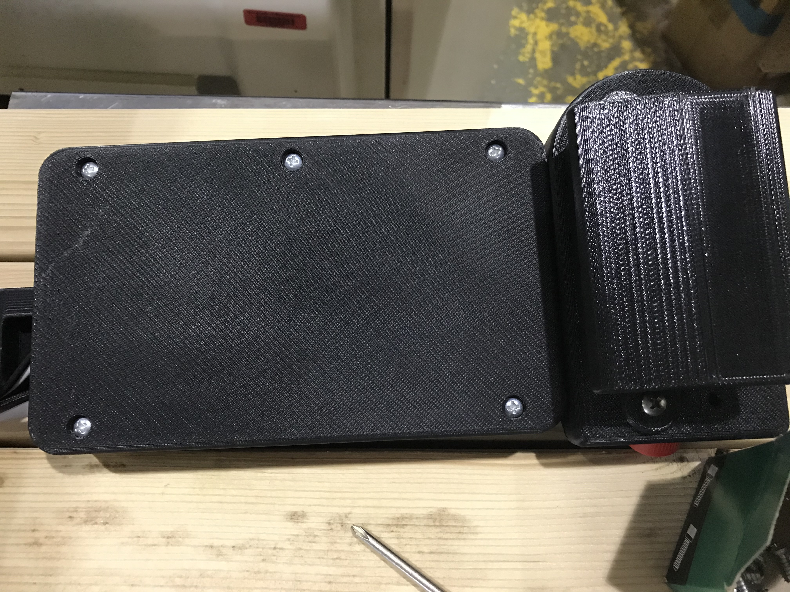<figcaption>Figure 25: Screwed Together Rasbperry Pi Teach Pendant Module
</figcaption></figure>

  

## 4.4 Cable Management

To finish the module, you will need 3 USB extension cords, of which, the USB cable attached to USB I/O ports of the Pi should end in a USB-B to connect into the 7-port USB extension. The other two USBs are the Spacemouse cable and the power cable for the Pi. The power cable can connect into a USB power brick on the outer power source mounted on the cabinet, the Spacemouse cable can go into the USB-A input on the side of the box and the Pi USB I/O cable goes into the USB-B input on the box. For the assembly of the cable bundle, once you have hooked up the extensions to best match the length of the cables, wrap zip ties around the connections of each extension cable to secure them together as shown below. Next measure out the amount of black wire wrap, cut it to size and then use the black wire wrap starting at the teach pendant side, insert the cable into the wrap and continue down the line until the end of the black wire wrap, do not wrap the entirety of the cable as it needs to split apart slightly at the cabinet. When you cut the wire wrap cut straight ends to best attach to the ending mounts. Using the wire wrap clip, attach the wire wrap to the Raspberry Pi Teach Pendant module as shown. At the box end use the printed wire holder part and another wire wrap clip to hold all the cables together into the end of the assembly. The Raspberry Pi Teach Pendant module is now ready to be plugged in and used.
  

<figure>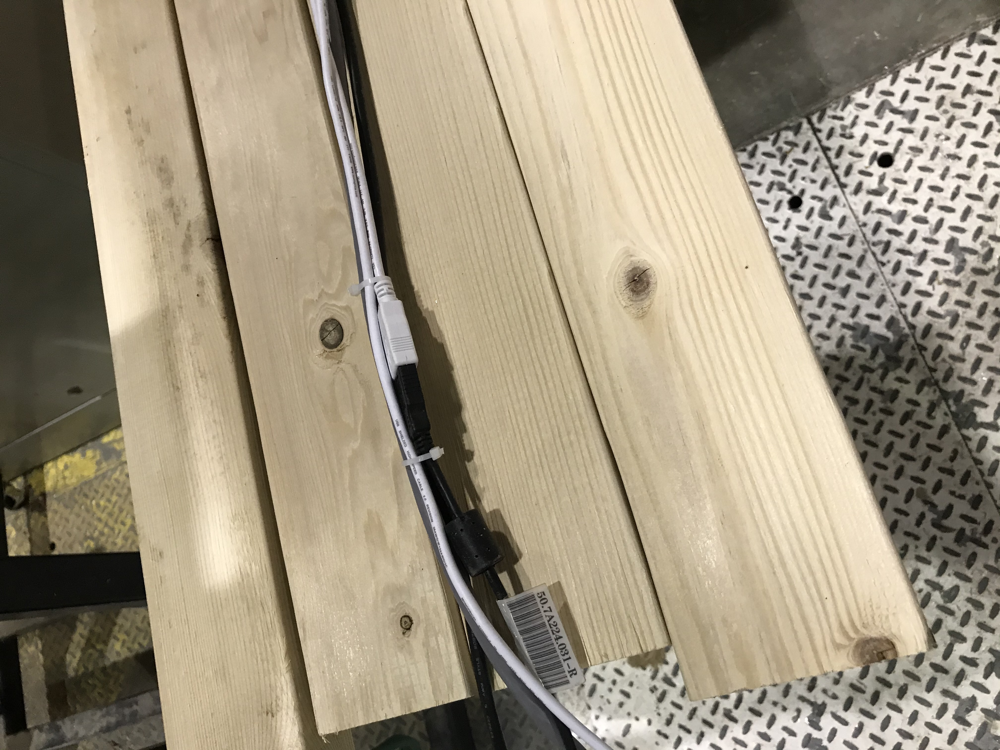<figcaption>Figure 26: Zip Tied Cables View 1</figcaption></figure>

  

<figure>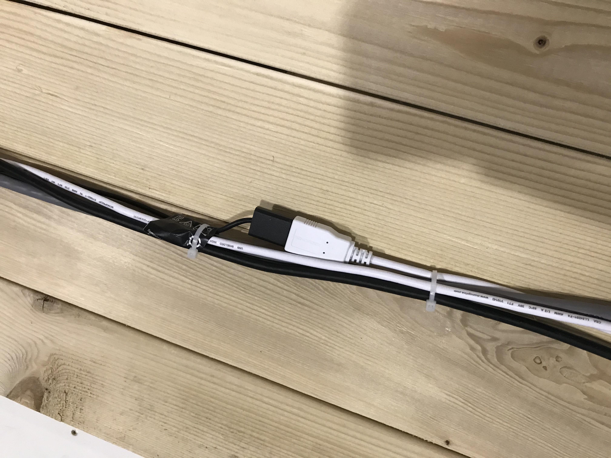<figcaption>Figure 27: Zip Tied Cables View 2</figcaption></figure>

  

<figure>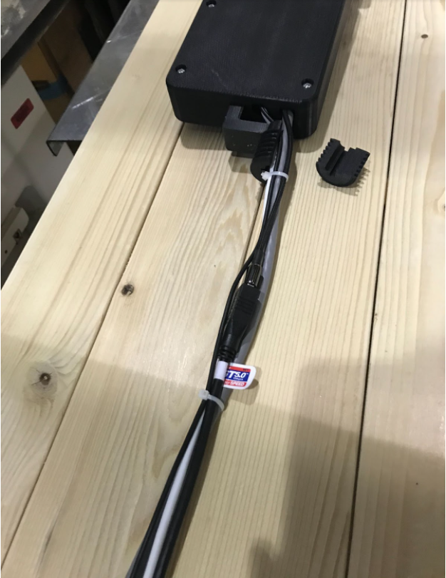<figcaption>Figure 28: Zip Tied Cables View 3</figcaption></figure>

  

<figure><figcaption>Figure 29: Initial Wire Wrap Attachment</figcaption></figure>

  

<figure>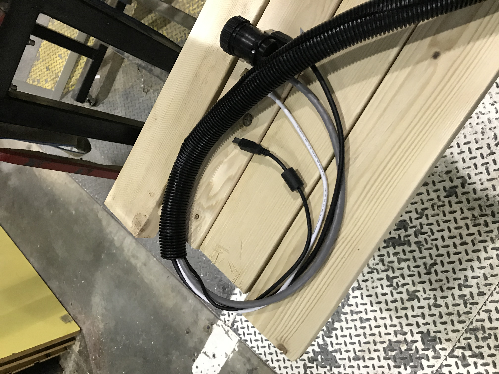<figcaption>Figure 30: Wire Wrapping Attachment View of Runtime Cabinet End</figcaption></figure>

  

<figure>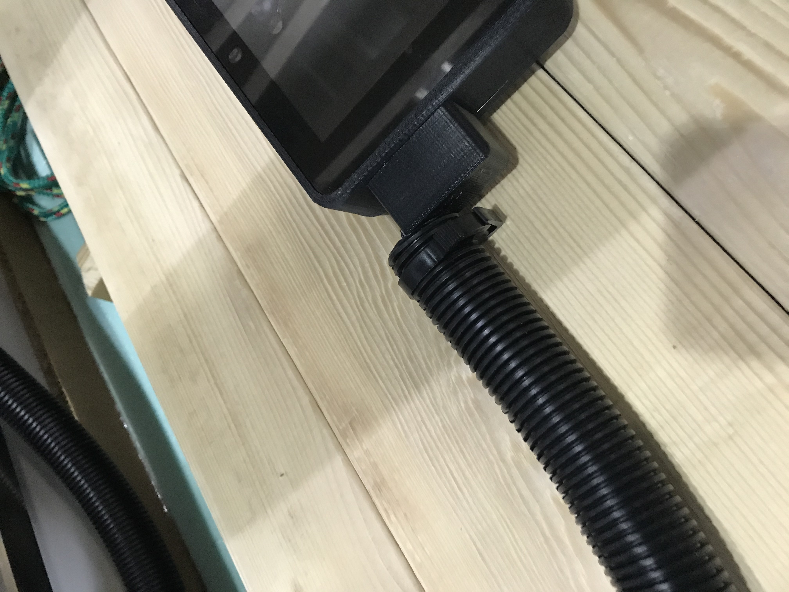<figcaption>Figure 31: Wire Wrapping Clamp Attached on Teach Pendant Side</figcaption></figure>

  

# 6.0: Network Bridge Setup for Runtime Computer

To set up the ethernet connection from the tablet to the network through a bridged connection you can follow the instructions given here: 
  
https://www.xmodulo.com/configure-linux-bridge-network-manager-ubuntu.html
