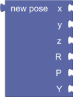

# Geometry Blocks and Sandbox Functions

"Geometry" section in the Blockly toolbox. Provides blocks and functions for geometry computations, with a focus on poses and transforms These functions and blocks are provided by the `pyri-common` package.

## geometry_pose_new

    geometry_pose_new(x, y, z, r_r, r_p, r_y)

Create a new pose using XYZ-RPY format. Units are meters and degrees

Parameters:

* x (float): X position in meters
* y (float): Y position in meters
* z (float): Z position in meters
* r_r (float): Roll in degrees
* r_p (float): Pitch in degrees
* r_y (float): Yaw in degrees

Return (Pose): Pose named array

## geometry_pose_inv

    geometry_pose_inv(pose)

Invert a pose

Parameters:

pose (Pose): The pose to invert

Return (Pose): The inverted pose

## geometry_pose_multiply

    geometry_pose_multiply(pose_a, pose_b)

Multiply one pose with another

Parameters:

* pose_a (Pose): The first pose
* pose_b (Pose): The second pose

Return (Pose): The result of the multiplication

## geometry_pose_component_get

    geometry_pose_component_get(pose, component_name)

Get an XYZ-RPY component of a pose.

Parameters:

* pose (Pose): The pose
* component_name (str): The component to get. May be `X`, `Y`, `Z`, `R_R`, `R_P`, or `R_Y`

Return (float): The pose value

## geometry_pose_component_set

    geometry_pose_component_set(pose, component_name, value)

Set an XYZ-RPY component of a pose. This function does not modify in place.
It returns a new pose.

Parameters:

* pose (Pose): The pose
* component_name (str): The component to get. May be `X`, `Y`, `Z`, `R_R`, `R_P`, or `R_Y`
* value (float): The new pose component value in meters or degrees

Return (Pose): The new pose with updated value

