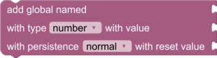

# Globals Blocks and Sandbox Functions

"Globals" section in the Blockly toolbox. Provides blocks and functions to read, write, create, and delete variables in the global variable table. These functions and blocks are provided by the `pyri-common` package.

## global_variable_add

    global_variable_add(global_name, datatype, value, persistence, reset_value)

Adds a new variable to the global variable table. The variable must not
already exist.

Parameters:

* global_name (str): The name of the new global variable. Must match regex `^[a-zA-Z](?:\w*[a-zA-Z0-9])?$`.
* datatype (str): The type of the new variable. May be `number`, `array`, `matrix`, `string`, or
  a valid Robot Raconteur data type.
* value (Any): The new variable value
* persistence (str): The persistence of the new variable. May be `normal`, `temporary`,
  `persistent`, or `constant`.
* reset_value (Any): The reset value of the variable. May be `None` for no value.

## global_variable_delete

    global_variable_delete(global_name)

Deletes a global variable

Parameters:

* global_name (str): The name of the global variable to delete

## global_variable_get

    global_variable_get(global_name)

Get the value of a global variable from the global variable table.

Parameters:

* global_name (str): The name of the global variable

Return (Any): The value of the variable.

## global_variable_set

    global_variable_set(global_name, value)

Set the value of a global variable in the global variable table. Global
variable must already exist, and the specified value must be compatible
with the global variable type.

Parameters:

* global_name (str): The name of the global variable
* value (Any): The new value of the global variable