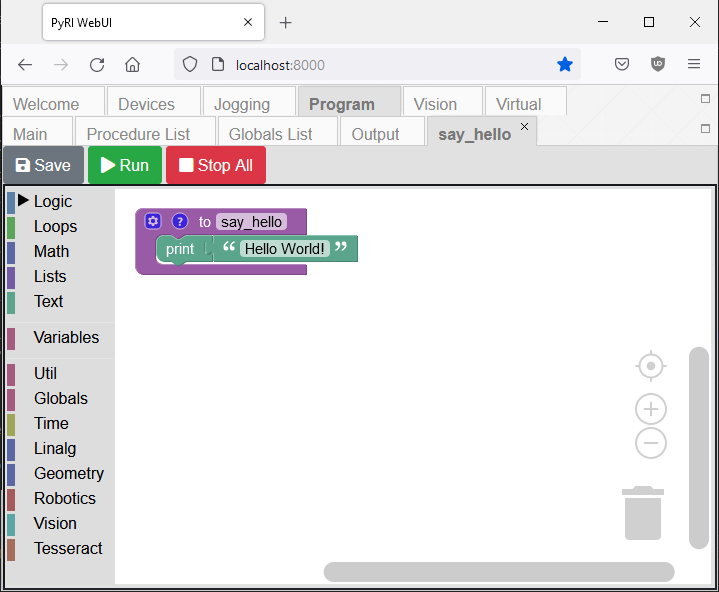
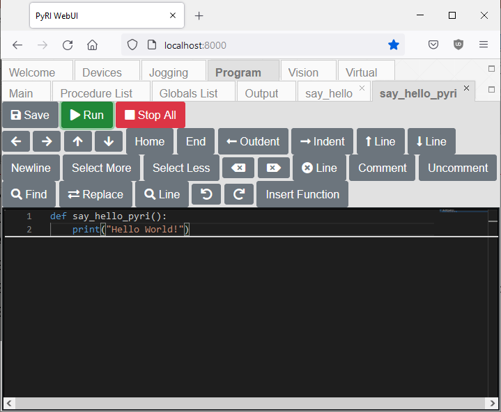

# Hello World Example Procedure

This example demonstrates printing "Hello World!" to the Output text area of the WebUI interface, which can be found in the Program -> Output panel.

This document assumes you have reviewed [README.md](../README.md), [InterfaceMenuDocumentation.md](InterfaceMenuDocumentation.md), and [user_programming_guide.md](user_programming_guide.md).

## Preparation

This example assumes that the teach pendant was installed using Conda. See the [README.md](../README.md) for installation instructions.

Start the teach pendant software in a Miniconda prompt using `pyri-core`:

```
conda activate pyri
pyri-core --db-file=my_project.db
```

Open Firefox or Chrome and load http://localhost:8000

No additional devices are required.

## Blockly Example

Create a new Blockly procedure using the Program -> Procedures panel named "say_hello". Enter the following block diagram:



Click "Save" and "Run" in the toolbar. Check the Program -> Output panel to see the printed text.

## PyRI Example

Create a new PyRI procedure using the Program -> Procedures panel named "say_hello_pyri". Enter the following program:



Click "Save" and "Run" in the toolbar. Check the Program -> Output panel to see the printed text.