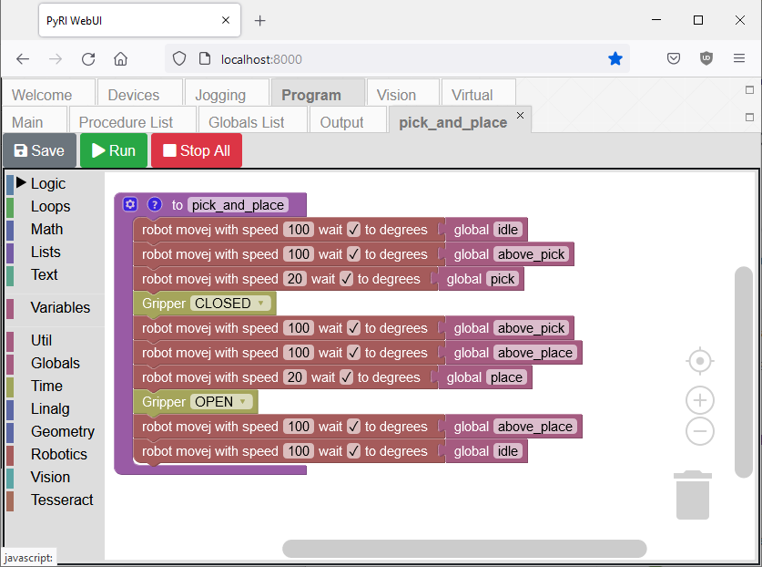
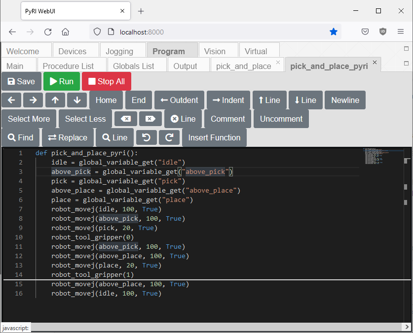

# Taught Pick and Place Example Procedure

This example demonstrates picking and placing objects using a single robot in the training simulator. This example can also be executed using a real robot, if it is available.

This document assumes you have reviewed [README.md](../README.md), [InterfaceMenuDocumentation.md](InterfaceMenuDocumentation.md), and [user_programming_guide.md](user_programming_guide.md).

## Preparation

This example assumes that the teach pendant and Robot Raconteur training simulator were installed using Conda. See the teach pendant [README.md](../README.md) and training simulator [README.md](https://github.com/robotraconteur-contrib/robotraconteur_training_sim/blob/master/README.md) for installation instructions

Start the training simulator:

```
conda activate rr_training_sim
run_2ur5e_sim
```

Wait for the simulator to start. Now run a script to move the cubes to the table:

On Windows, run:

```
python %CONDA_PREFIX%\gz_example\example_scripts\gazebo_move_cubes.py
```

On Linux, run:

```
python $CONDA_PREFIX/gz_example/example_scripts/gazebo_move_cubes.py
```

Run this script at any time to move the cubes back on the table.

Start the teach pendant software in a second Miniconda prompt using `pyri-core`:

```
conda activate pyri
pyri-core --db-file=my_project.db
```

Open Firefox or Chrome and load http://localhost:8000

This example requires the `robot` local device to be added. Use Devices -> Add Device to add the following devices:

| Local Name | Displayed Device Name |
| ---               | ---                         |
| robot | ur5e_robot |
| tool  | ur5e1_gripper |

The "Displayed Device Name" is the Device name shown in the "Add Device" dialog.

## Waypoint Training

The procedure expects five taught joint poses. These joint poses are taught using the Jog window, by jogging the robot to the desired position, and saving using the "Edit Standby" dialog. See [InterfaceMenuDocumentation.md](InterfaceMenuDocumentation.md) for more information on using the Jog window to save waypoints.

| Variable Name | Description |
| ---           | ---         |
| idle | Robot idle pose between pick operations |
| before_pick | Robot pose positioned above cube, ready to be lowered to pick |
| pick | Robot pose positioned in contact with cube, ready for gripper to close |
| before_place | Robot pose positioned above target location, ready to be lowered for place |
| place | Robot pose positioned in desired place location |

## Blockly Procedure

Create a new Blockly procedure using the Program -> Procedures panel named "pick_and_place". Enter the following block diagram:



Click "Save" and "Run" in the toolbar. The robot will move the cube on the table. Use `gazebo_move_cubes.py` to reset the cube positions.

## PyRI Procedure

Create a new PyRI procedure using the Program -> Procedures panel named "pick_and_place_pyri". Enter the following program:

```python
def pick_and_place_pyri():
    idle = global_variable_get("idle")
    above_pick = global_variable_get("above_pick")
    pick = global_variable_get("pick")
    above_place = global_variable_get("above_place")
    place = global_variable_get("place")
    robot_movej(idle, 100, True)
    robot_movej(above_pick, 100, True)
    robot_movej(pick, 20, True)
    robot_tool_gripper(0)
    robot_movej(above_pick, 100, True)
    robot_movej(above_place, 100, True)
    robot_movej(place, 20, True)
    robot_tool_gripper(1)
    robot_movej(above_place, 100, True)
    robot_movej(idle, 100, True)
```



Click "Save" and "Run" in the toolbar. The robot will move the cube on the table. Use `gazebo_move_cubes.py` to reset the cube positions.
