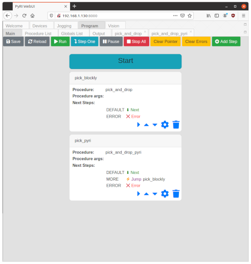
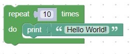
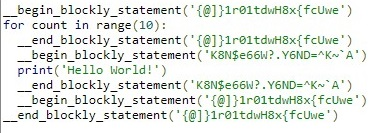

# Python Restricted Industrial (PyRI) Open Source Teach Pendant Programming Environment Software Architecture

*Version 0.2*

Last Updated: August 17, 2021

John Wason, Ph.D.
Owner, Wason Technology, LLC  
Visiting Researcher, Rensselaer Polytechnic Institute  

## Introduction

The open-source teach pendant is intended to provide a high-level
programming environment for use with open-source ecosystems like ROS and
Robot Raconteur. Developing software for robotics and automation using
these ecosystems is currently a difficult task, requiring significant
software development expertise. The open-source teach pendant
abstracts away the complexities of the open-source ecosystem, and present
the user with either a simplified Blockly or Python programming
environment. The Blockly or Python programs interact with ROS
and/or Robot Raconteur through a series of plugins and extensions. These plugins
encapsulate the complexity of the ecosystems and provide high-level
functionality. It is assumed that the user is familiar with using
complex computer software, but are not familiar with software
development. A good example of a target user is a person familiar with
computer strategy or sandbox games. This document provides an overview
of the user program composition and simplified software languages, the
user programming environment, the software architecture that implements
this programming environment, and how user software is executed.

This is the second architecture design, that has been simplified
from the initial 0.1 version.

# Architecture Overview

The objective of the teach pendant is to allow for high-level
programming of industrial equipment, such as robots, without
requiring extensive software development experience. 

The teach pendant software is designed to be highly configurable
for a variety of industrial applications. For that reason,
the core software only contains the minimum capabilities required
to implement the programming environment. All capabilities that
involve performing a specific task or operating a specific
type of equipment are contained in extensions.

The teach pendant software consists of a "runtime" component that 
interacts with the system and runs user programs, and a "WebUI"
which provides a browser-based user graphical user interface. The
runtime component provides an HTTP web service, to which a browser
connects. The user interface is downloaded by the browser as a
standard web page, and executes as a web application. This design
allows for users to quickly connect with any modern web browser
without requiring software installation. It also future-proofs
the installation, since there is no risk of losing the client
software or having the client software be incompatible with
future operating systems.

## Runtime Component

The "runtime" component runs on an industrial computer, and
becomes a permanent part of the system installation. It is
mainly developed using Python, using a microservices architecture
loosely based on serverless computing. Robot Raconteur is used
to communicate between the various micro-services, between
the micro-services and the browser, and with other devices
in the system. The runtime provides the following high
capabilities:

* Device Discovery and Management
* User Program Execution
* Variable Storage Database
* WebUI Server
* Service Lifecycle Management
* Extensibility

The core runtime consists of the following microservices:

* `variable_storage`
* `device_manager`
* `devices_states`
* `sandbox`
* `program-master`
* `webui_server`
* `core` (service lifecycle)

Capabilities for robotics robotics and vision are provided by the
`pyri-robotics` and `pyri-vision` packages. These packages
add the following microservices:

* `robotics_jog`
* `robotics_motion`
* `vision_viewer`
* `vision_camera_calibration`
* `vision_robot_calibration`
* `vision_aruco_detection`
* `vision_template_matching`

The details of each service is discussed later in this document.

The runtime component can be extended in two ways:

* Add additional services
* Add plugins for existing services

Both the additional services and plugins are distributed as standard
Python packages. This is done using either Wheels or Conda packages.

Adding additional services is straightforward. Develop a Python
Robot Raconteur service that is compatible with the `Device` concept 
(see below), and use the `PyriServiceNodeSetup` class included
in `pyri-common` for node and lifecycle management. These services
are effectively independent of the rest of the runtime, and can use
any dependencies that are necessary.

Plugins add functionality to existing services. This is done
using the `entry_points` specification that is part of the
Python `setup.py` package file. Services that use plugins
will scan for the appropriate `entry_points` specified by
Python packages, and instantiate the provided "factories". Each plugin
type expects a certain "factory" type instance to be returned by 
the `entry_points`. For example, the sandbox searches for the
`pyri.plugins.sandbox_functions` entry point. It expects a factory
instance of type `PyriSandboxFunctionsPluginFactory` to be returned
by the entry point. This factory returns the sandbox functions that
should be made available to the sandbox procedures. The
`pyri-robotics` package provides the sandbox functions for robotics
using this method.

## Device Concept

The teach pendant architecture uses the concept of "devices" to
organize the microservices and available devices on the network.
Microservices that do not communicate with a physical device
are considered to be "virtual devices". Every microservice
or device that wants to communicate with the teach pendant
must:

* Provide a discoverable Robot Raconteur service
* Implement the `com.robotraconteur.device.Device` standard Robot Raconteur type
* Include `DeviceInfo` fields in its service attributes

Every standard Robot Raconteur type for physical devices
already implements `com.robotraconteur.device.Device`, including
`com.robotraconteur.robotics.robot.Robot`, the standard type for robots.

The `com.robotraconteur.device.Device` type provides the 
`com.robotraconteur.device.DeviceInfo` structure through a property 
member. This structure contains extensive information about the device,
its class, and its capabilities. This information is used by the
teach pendant to connect and interact with the device.

## WebUI

The WebUI is provided through the `webui-server` HTTP server. It
is an advanced web application, which takes advantage of HTML5,
CSS, JavaScript, and WebAssembly. The web application is
mostly written in Python. This is made possible by Pyodide,
a Python scientific software stack that runs in the browser
using WebAssembly. A highly modified version of Robot Raconteur
has been combined with Pyodide to create Robot Raconteur Pyodide.
Robot Raconteur Pyodide implements client communication functionality 
for use within web browsers using Web Sockets. Pyodide
includes NumPy, which is a critical library for robotics. Several
other common JavaScript libraries are used, including but not limited
to Bootstrap, Vue.js, GoldenLayout, jQuery, Blockly, and Monaco Editor.

The WebUI displays multiple reorganizable panels. These panels can
be dragged by the user to customize how they are displayed. Without
extensions, the WebUI has the following default panels:

* Welcome
* Devices
* Program
  * Main (state machine)
  * Procedure List
  * Globals List
  * Output

The `pyri-robotics-browser` and `pyri-vision-browser` extension packages 
add the following panels:

* Jog
* Vision
  * Camera List
  * Camera Viewer

Like the runtime, the WebUI can be extended using Python packages. The
WebUI has a sophisticated startup process, that uses Python Wheels to
contain the WebUI application code. These wheels are stored in a special
directory for the WebUI server. During startup, all Wheels in this special
directory are downloaded by the WebUI browser and extracted into the Pyodide
virtual filesystem. Once extracted, the packages can be used as normal. The
`entry_points` method, as described above for the runtime component, is used
for WebUI plugins. This allows for new panels and other enhancements to be
easily added. Distributing WebUI packages is complex because it requires
placing the Wheel file in the special WebUI directory. This is best
accomplished using Conda. See the extension development guide
for more details.

## User Programs

“User Programs” refers to programs that are developed using the teach
pendant software. User programs are stored in a database file, which
serves as the save file for project. Typically SQLite is used. 

User programs are made up of the following
components:

- A top-level state machine that executes procedures and selects the
next state based on the output of the procedures
- A set of procedures developed using either Blockly or the Restricted
Python Dialect
- A set of global variables
  - Stored using Robot Raconteur data types and serialization
  - May be generic data structures, or specific types such as Waypoints
  - May have four persistence levels: temporary, normal, persistent, or constant
  - (Resources used by the program are stored as constants)

User programs interact with the rest of the teach pendant software and 
devices in the system using "sandbox" and "blockly" plugins. These
concepts are explained further in the sandbox service section.

### User Program Main State Machine

The top level of a user program is the state machine. State machines are
nearly always used as the high level construct for automation programs,
since the tasks being accomplished usually have a state-machine decision
structure.

Blockly and the Restricted Python Dialect do not have the inherent
ability to arbitrarily move to a different step in a procedure. This
type of behavior is typically implemented in C, C\#, Python, or other
programming language using a while loop with a switch statement. (In
Python, since there isn’t a switch statement, if/elif/else statements
are used.) Similar logic is implemented using classes and functions, but
the logic is generally very similar. Each step in the state machine is
selected with a case, and a variable is used to store the next desired
state. When a state change is needed, the desired state variable is set,
and the while loop is continued. The next iteration of the while loop
will select the desired case statement, and the execution will continue
at that state. The following is a simplified example of what a state
machine may look like in Python:

    while True:
        if state == 1:
            res = do\_something\_1()
            if res:
                state = 2:
                continue
            else:
                state = 3:
                continue
        elif state == 2:
            res = do\_something\_2()
            if res:
                state = 1
                continue
            else:
                state = 3
                continue
        elif state == 3:
            res = do\_something\_3()
            if res:
                state = 1
            elif
                raise Exception("Operation failed\!")
        else:
            raise Exception("Unknown state\!")

While this design is effective, it can be challenging to get right even
for experienced programmers.

The top level of a user program consists of a state machine with
multiple steps. Each step executes a procedure, and selects the next
state based on the result of the procedure. Procedures may be
implemented using Blockly or the Restricted Python Dialect.
It is possible that many user programs will be able to be
developed as state machines without needing to implement any Restricted
Python Dialect or Blockly procedures. Each step is assigned a name.

Each step of the state machine is able to pass parameters to and
execute a single procedure. The parameters are plain strings passed
to the procedure. The state machine is able to
select the next state based on the result of the procedure. The state
machine itself does not have any logic available beyond selecting the
next state. This selection will be based either on a string returned by
the procedure on success, or the type of exception on failure.

The following is an example of a state machine in the editor panel:

The state machine is designed to allow for the user to arbitrarily jump
to a step of the program. The ability to jump around is possible because
of the global variable table and the state machine design. Since all the
current data is stored in the global variable table and not within the
steps, the steps can be executed in arbitrary order (within the
specified limits of the program) without losing data integrity.

The state machine is also designed to allow for the program to be
continued after the system has been power cycled. This is
accomplished by storing the current state and the state machine data
in the program database.

Currently, the state machine does not have the ability to handle
asynchronous events, or have special capabilities for startup and
shutdown. These capabilities can be added in the future.

### Procedures

User defined procedures are used to execute program logic. They are
called by the state-machine steps, or from other procedures/functions.
Procedures accept parameters, can read and write global variables, can
interact with plugins, can raise errors, and can specify a result value
string. The result value or exception is used to determine the next step
the state machine should execute. Procedure variables are not persisted 
between
system restarts. Any local data and stack information is lost when the
procedure is exited or aborted by a shutdown. Data that must be retained
should be stored in the global variable table.

Procedures are executed using a sandboxed Python execution environment.
This environment is configured to restrict the Python code to a subset
of standard Python and restrict access to the standard libraries. The
objective is to create a programming environment that is simple to
learn, easy to analyze, and limits malicious software. The full Python
environment is available using plugins, which can be called from the
restricted Python environment. It is expected that plugin developers
will have the experience to reliably use the full feature set of Python.
These plugins are then available to less skilled developers using the
teach pendant interface. See 
[pyri_dialect_specification.md](pyri_dialect_specification.md) for more
information on the restricted Python dialect.

Procedures may optionally be developed using Blockly instead of Python.
This is an attractive option for users who are not experienced
programmers. Blockly and the closely related MIT Scratch visual
programming languages are very popular in education and are widely used
in primary and secondary schools. Programs written in Blockly are
compiled to Python for execution. To allow for more granular control,
Blockly has the option to insert prefixes before and after statements. 
This can be used to track and regulate the execution of the
Blockly programs. The following figures demonstrate this behavior.
(Blocks are assigned random strings as identifiers, as shown in the
\_\_begin\_blockly\_statement and \_\_end\_blockly\_statement Python
function calls.)

Sandbox functions are special functions that are made available within
the sandbox for procedures to use. These functions are "injected" into
the procedure execution context when the procedure is executed.
These functions are included in the base software installation, and
by plugins to add specialized functionality. The base software
and plugins may also provide corresponding Blockly blocks that
call sandbox functions, so that they can be accessed using the
visual programming environment.

### Global Variables

Global variables exist at the top level of the user program, alongside
the state machine. The global variables are stored in a database,
typically SQLite. The `variable_storage` service implements the database
and variable functionality. These variables can have different types,
including taught waypoints.

Global variables can have one of four storage levels:

- **Temporary:** Deleted on program exit
- **Normal:** Cleared to default on program restart
- **Persistent:** Maintain the current value after program or system restarts. Optionally have a specified constant default value. May optionally be set to default value on program start
- **Constant:** Always the value set by the user

The global variable table can be “reset to default”, which immediately
deletes all temporary global variables and sets normal/persistent variables to
default.

Global variables may modified by procedures, sandbox functions,
plugins, and services.

Global variables must have an assigned type. This type must correspond
to a known Robot Raconteur type. The known Robot Raconteur types can
be expanded using the `pyri.plugins.robdef` plugin type.

The user can modify global variables using a graphical user interface
editor in the WebUI, if a matching editor is available. Each
variable type may optionally have a specialized editor. Additional
variable type editors can be provided using plugins.

# Runtime

The runtime component consists of several microservices that
implement the backend functionality of the teach pendant. The runtime
is a permanent part of the system, while the teach pendant
can be disconnected and removed if it is no longer needed after
programming is complete. The runtime component communicates with
the rest of the system and executes the developed software. The
prototype teach pendant hardware uses an Intel NUC for the runtime
computer, although any moderately powerful industrial computer
should be sufficient, depending on the extensions used. For instance,
motion planning using the Tesseract extension package will need a more
powerful computer compared to running only the base software.

The runtime has the capability to launch and manage the lifecycle
of the relevant microservices. This is implemented using the
`pyri-core` service.

## variable_storage Service

* Python Package: `pyri-variable-storage`
* Conda package: `pyri-robotics-superpack`
* Service: `pyri-variable-storage-service`
* robdef: `tech.pyri.variable_storage`
* Repo: https://github.com/pyri-project/pyri-variable-storage

All data for the active program including, but not limited to,
added devices, procedures, global variables, state machines,
and any other program related data are stored in the global
variable table. This table is implemented using SQLAlchemy, a
database toolkit for Python. SQLAlchemy supports several backend
databases, including SQLite, PostgresSQL, MySQL, and Microsoft
SQL Server. Typically, SQLite is used since it is the simplest,
and results in a single save file. (SQLite is desirable as a
save format for an open-source project, since it is easily
readable from any major programming environment.)

The global variable table has the following fields:

| Field name | Field type | Description |
| ---        | ---        | ---         |
| name       | String(512) | Name of the variable |
| device     | String(128) | Name of the device that owns the variable |
| datatype  | String(128) | Robot Raconteur data type string |
| value      | LargeBinary | The data serialized as a Robot Raconteur message element |
| reset_value | LargeBinary | The reset value serialized as a Robot Raconteur message element |
| persistence | Integer | The persistence of the variable to reboots and resets |
| default_protection | Integer | The default protection level of the variable |
| doc | Text() | Documentation for the variable |
| created_on | LargeBinary | Robot Raconteur serialized time stamp |
| updated_on | LargeBinary | Robot Raconteur serialized time stamp |
| tags       | string array | Tags to describe the category and usage of variable |
| attributes | string dict | Key value string pairs for general purpose metadata |
| permissions | | User and group access permissions |

Variables in the table are scoped by "device" name. For instance,
the device name "device_manager" is used to store data for the
`device_manager` service. Several special "device names" are
reserved and used for program storage: "globals", "program",
and "procedure", which are used to store program data.

Each variable has a "name", which must be unique within the
device scope.

Each variable has a "value" and a "reset value". "reset values"
are optionally specified for when the user requests a program
reset. The persistence of the variable controls when the
value of the variable is reset.

Variables can have four levels of persistence:

- **Temporary:** Deleted on program exit
- **Normal:** Cleared to default on program restart
- **Persistent:** Maintain the current value after program or system restarts. Optionally have a specified constant default value. May optionally be set to default value on program start
- **Constant:** Always the value set by the user

Each variable has "tags" and "attributes". Tags are short plain strings
used to provide context to the variable. For instance, tags are used to
specify that a numeric array should be used as a waypoint, instead be
treated as a plain array. Attributes are string key/value pair that
can be used to store arbitrary data.

The variable values are stored as serialized Robot Raconteur types.
In order to correctly serialize the data, the `variable_storage` 
service must have the corresponding `robdef` registered with the node.
This requirement is due to the peculiar asymmetry of Robot Raconteur.
Robot Raconteur is designed to provide arbitrary `robdef` type 
definitions to the client, so that the client does not need to have
any a priori information to access the service. The reverse is not true.
The service is not able to receive and understand an arbitrary type.
`variable_storage` uses the `pyri.plugins.robdef` plugin type
to add additional `robdef` service definitions to the node. The plugin
instances provide the full text of the service definition, which is
registered with the node on startup. **If the plugin configuration 
is changed, the `variable_storage` service must be restarted.**

The variable storage service exposes the Robot Raconteur service
`variable_storage` with type `tech.pyri.variable_storage.VariableStorage`.

The `variable_storage` service is started by `pyri-core` and is added
as a default device using the `pyri.plugins.service_node_launch`
plugin type.

The current variable table design does not have any provisions
for hierarchy of variables. For instance, sequences and trees
of variables are poorly handled. Currently, sequences are implemented
as string lists of variable names, and trees are handled using attributes.
Future development should provide a more consistent way to handle
these relationships.

## device_manager Service

* Python Package: `pyri-device-manager`
* Conda package: `pyri-robotics-superpack`
* Service: `pyri-device-manager-service`
* robdef: `tech.pyri.device_manager`
* Repo: https://github.com/pyri-project/pyri-device-manager

The teach pendant software is organized around the concept of
"devices". This concept is based on the [Robot Raconteur standard
types](https://github.com/robotraconteur/robotraconteur_standard_robdef).
All standard device objects implement the `com.robotraconteur.device.Device`
type. This type has a single readonly property member `device_info`, which
returns a `com.robotraconteur.device.DeviceInfo` structure. This structure
contains the following fields:

| Field name | Field Type (simplified) | Description |
| ---        | ---                     | ---         |
| `device`     | `Identifier`              | Unique identifier for this device |
| `parent_device` | `Identifier`           | An optional "parent" device. Used for compound devices |
| `manufacturer`   | `Identifier`           | The manufacturer of the device |
| `model`          | `Identifier`          | The model of the device |
| `options`        | `DeviceOption{list}`        | A list of installed device options |
| `capabilities`   | `DeviceCapability{list}`    | A list of capabilities provided by the device |
| `serial_number`  | `string`              | The serial number of the device |
| `device_classes` | `DeviceClass{list}`   | A list of device classes. "Device class" is separate from software class |
| `user_description` | `string`            | A user defined description of device |
| `description_resource` | `ResourceIdentifier` | A resource that provides additional files about the device |
| `implemented_types` | `string{list}` | A list of Robot Raconteur object types implemented by the device |
| `device_origin_pose` | `NamedPose` | The origin of the device in the workspace, or relative to the parent device |
| `associated_devices` | `Identifier{string}` | A map of devices that are associated with this device |
| `extended` | `varvalue{string}` | Future-proofing field to hold additional information |

The `DeviceInfo` structure contains critical information
for the teach pendant software to interact with devices.

All services that the teach pendant interact with
are considered "Devices". Software-only devices
such as the core microservices that make up the
core software are considered "virtual devices", although in
practice this has no distinction an the software level.
All services that the teach pendant interacts with
must provide a `DeviceInfo` structure by implementing the
`Device`  standard type for the teach pendant to
recognize the service.

Devices are distinguished using Robot Raconteur `Identifiers`,
implemented by the `com.robotraconteur.identifier.Identifier`
type. The Identifier type has the following fields:

| Field Name | Field Type (simplified) | Description |
| ---        | ---                     | ---         |
| `name`     | `string`                | A human-readable name, not required to be unique |
| `uuid`     | `UUID`                  | A 128-bit gen-4 UUID, required to be unique |

`Identifiers` are designed to allow for identification using
either a human-readable string name, or a 128-bit UUID.
UUID (Universally Unique Identifier) is a randomly generated
128-bit number that is statistically guaranteed to be unique. UUIDs
are heavily used in computer systems to generate unique ids
without requiring a central authority to distribute ids. Robot Raconteur
Identifiers allow for either the name, the UUID, or both
to be used for identification. A blank string or a zero UUID
are considered "wildcard", and will be ignored during
identifier matching.

Robot Raconteur Discovery is used to detect devices. The device manager
searches for `com.robotraconteur.device.Device` services on
the local network. IPv6 addresses or local connections are favored.
Devices are expected to have a static IPv6 address. They will need
to be removed and added again if the connection URL changes.
**Services that are connected by the WebUI must have IPv4
discovery enabled**. This is done using the
`--robotraconteur-tcp-ipv4-discovery=true` command line argument
or the `RobotRaconteurNodeSetupFlags_TCP_TRANSPORT_IPV4_DISCOVERY`
node setup flag. IPv4 discovery is disabled by default.

The device manager stores the selected devices with
an assigned "local name". The local name is an alias
assigned to refer to the device within the teach pendant
software. This is typically a short name like `robot`
or `joystick`. The device manager returns the full
information and/or creates connection to a device
based on this local name.

The following table contains the typical local
names of devices on a fully configured
system. Several local devices are required for
normal operation:

| Local Name | Robot Raconteur Type | Service | Package | Required |
| ---        | ---         | ---      | ---   | --- |
| `variable_storage` | `tech.pyri.variable_storage.VariableStorage` | `pyri-variable-storage-service` | `pyri-variable-storage` | Yes |
| `device_manager`   | `tech.pyri.device_manager.DeviceManager`     | `pyri-device-manager`           | `pyri-device-manager`   | Yes |
| `devices_states`   | `tech.pyri.devices_states.PyriDevicesStatesService` | `pyri-devices-states-service`| `pyri-devices-states` | Yes |
| `sandbox`          | `tech.pyri.sandbox.PyriSandbox` | `pyri-sandbox-service` | `pyri-sandbox` | Yes |
| `program_master`   | `tech.pyri.program_master.PyriProgramMaster` | `pyri-program-master-service` | `pyri-program-master` | Yes |

The `pyri-webui-server` and `pyri-core` services do not currently expose Robot Raconteur services.

The `pyri-robotics` and `pyri-vision` packages are frequently installed,
and use the following local names:

| Local Name | Robot Raconteur Type | Service | Package | Required |
| ---        | ---         | ---     | ---     | ---      |
| `robotics_jog` | `tech.pyri.robotics.jog.JogRobot` | `pyri-robotics-jog-service` | `pyri-robotics` | Yes |
| `robotics_motion` | `tech.pyri.robotics.motion.RoboticsMotionService` | `pyri-robotics-motion-service` | `pyri-robotics` | Yes |
| `vision_camera_viewer` | `tech.pyri.vision.viewer.CameraViewer` | `pyri-vision-camera-viewer-service` | `pyri-vision` | Yes |
| `vision_camera_calibration` | `tech.pyri.vision.calibration.CameraCalibrationService` | `pyri-vision-camera-calibration-service` | Yes |
| `vision_robot_calibration` | `tech.pyri.vision.robot_calibration.CameraRobotCalibrationService` | `pyri-vision-robot-calibration-service` | Yes |
| `vision_aruco_detection` | `tech.pyri.vision.aruco_detection.VisionArucoDetectionService` | `pyri-vision-aruco-detection-service` | Yes |
| `vision_template_matching` | `tech.pyri.vision.template_matching.VisionTemplateMatchingService` | `pyri-vision-template-matching-service` | Yes |

The `pyri-robotics` expects the following physical devices by default:

| Local Name | Robot Raconteur Type | Description |
| ---        | ---                  | ---         |
| `robot` | `com.robotraconteur.robotics.robot.Robot` | The default robot |
| `tool` | `com.robotraconteur.robotics.tool.Tool` | The default robot gripper |
| `joystick` | `com.robotraconteur.hid.joystick.Joystick` | The SpaceMouse jog joystick (optional) |

Additional robots and tools can have arbitrary names.

The device manager stores the added devices in the `variable_storage` service,
with the device name `device_manager`. Each device is stored in a single variable,
with local name of the device used as the variable name. The variable
entry has the type `tech.pyri.device_manager.PyriDeviceInfo`.

The device manager attempts to create a persistent connection to 
the `variable_storage` service. It either finds the `variable_storage`
service using discovery, discovery with a specified Identifier, 
or through a provided URL. The connection options are configured
using command line options for the device manager. By default,
it will look for `variable_storage` available using the local
transport, connecting to a service running on the same computer.

The device manager provides a `DeviceManagerClient` class, which
is contained in the `pyri-common` package. The `DeviceManagerClient`
queries the device manager and either provides information
or creates persistent connections to other devices. The
device manager client needs to connect to the device manager. This
is done either using discovery, discovery with a specified
Identifier, or through a provided URL.

(Note that the device manager connecting to the `variable_storage`
service or the device manager client connecting to the `device_manager`
is different than the typical device connection process, since it
precedes using the device manager. Raw Robot Raconteur discovery
or a Robot Raconteur URL is used to establish these initial connections.)

Each service, each client, and the WebUI, which interacts with devices
needs to run an instance of the `DeviceManagerClient`. This is the
core functionality provided by the software to establish connections.

By default, the `DeviceManagerClient` will connect to all
available devices. Since this is often unnecessary, it
can be configured to connect only to devices with specified
local names or specified types.

When a new `variable_storage` database is created, it will
have no devices added, and the software cannot function.
`pyri-core` will automatically add devices based on instructions
located in each package as `entry_points` plugins.

Devices can be added and removed using the `device_manager` service
object API, or using the WebUI. Most users will use the
WebUI `Devices` panel to add devices on the network.

The device manager service exposes the Robot Raconteur service
`device_manager` with type `tech.pyri.device_manager.DeviceManager`.

The `device_manager` service is started by `pyri-core` and is added
as a default device using the `pyri.plugins.service_node_launch`
plugin type. The command name is `pyri-device-manager-service`

## devices_states Service

* Python Package: `pyri-devices-states`
* Conda package: `pyri-robotics-superpack`
* Service: `pyri-devices-states-service`
* robdef: `tech.pyri.devices_states`
* Repo: https://github.com/pyri-project/pyri-devices-states

The teach pendant software needs to track and display the status
and state of the devices in the system. The `devices_states`
service is used to collect and aggregate this data, and
provide a centralized distribution of the current state
of all devices. It also provides utility functions for
querying `DeviceInfo` and specialized info structures
like `RobotInfo`. There are four reasons that this
service is needed:

1. Providing a central distribution point means that clients do
not have to connect to each individual device
1. Security and/or network restrictions may not allow every
device to connect to every other device
1. The WebUI may not be able to connect to every device
due to restrictions on WebSocket networking
1. The WebUI (and possibly other clients) cannot process
incoming state data at high rates, which can be
beyond 1kHz from many devices

The `devices_states` service provides updated data at approximately 
10 Hz.
It is intended to be used for display and data logging. It is
not recommended it be used for real-time control. The WebUI
uses `devices_states` for all device status and state display
information.

The state data is provided by the `devices_states` wire, with
type `tech.pyri.devices_states.PyriDevicesStates`. This structure
contains a map of type `tech.pyri.devices_states.PyriDeviceState`,
one entry for each device, which has the following fields:

| Field Name | Field Type (simplified) | Description |
| ---        | ---                     | ---         |
| `local_device_name` | `string` | The `local_device_name` alias |
| `device` | `Identifier` | The Robot Raconteur device Identifier |
| `connected`   | `bool`  | True if the device is currently connected to `devices_states` |
| `ready`   | `bool`      | True if the device is ready for operation |
| `error`   | `bool`      | True if the device is in an error state |
| `info_seqno` | `uint32` | The `seqno` of the current state information from the device |
| `state` | `PyriDeviceStateTyped{list}` | Map of device type specific information. See below. |
| `extended` | `varvalue{string}` | Future-proofing field to hold additional information |

The `PyriDeviceState` structure holds the state information for
the individual devices. The `local_device_name`, `device`, `connected`,
`ready`, `error`, and `info_seqno` are common to all device types,
and are used to determine the readiness and error status of the system.
The `state` field is more complex, and contains device type specific
information. For instance, the `com.robotraconteur.robotics.robot.Robot` type
provides state information using the
`com.robotraconteur.robotics.robot.RobotState` structure. The
`tech.pyri.devices_states.PyriDeviceStateTyped` structure holds the
device specific state information. It has the following fields:

| Field Name | Field Type (simplified) | Description |
| ---        | ---                     | ---         |
| `type`     | `string`  | The Robot Raconteur type of the state structure |
| `display_flags`| `string{list}` | A human readable list of state flags that should be displayed to the user |
| `state_data` | `varvalue` | The device specific state data, as a `varvalue` |

The `PyriDeviceStateTypes` is contained in the `state` 
map of `PyriDeviceState`. The key of this map value
should be the same as `type`.

The `devices_states` service requires plugins to understand 
the type specific state data and info structures. This is
implemented using the `pyri.plugins.device_type_adapter`. 
The associated plugin factory `PyriDeviceTypeAdapterPluginFactory`
is expected to create adapters that extend
`PyriDeviceTypeAdapter`. Upon creation, the adapter will
connect to the specified device and begin streaming
state data contained in `PyriDeviceTypeAdapterExtendedState`
instances. The `PyriDeviceTypeAdapter` has three
important functions:

| Function Name | Description |
| ---           | ---         |
| `get_robotraconteur_type` | Return the Robot Raconteur service object type this adapter connects |
| `get_extended_device_infos` | Return device type specific device infos structure |
| `get_extended_device_states` | Return the device type specific state information, contained in `PyriDeviceTypeAdapterExtendedState` instances |

The devices states service exposes the Robot Raconteur service
`devices_states` with type 
`tech.pyri.devices_states.PyriDevicesStatesService`.

The `devices_states` service is started by `pyri-core` and is added
as a default device using the `pyri.plugins.service_node_launch`
plugin type. The command name is `pyri-devices-states-service`.

## sandbox Service

* Python Package: `pyri-sandbox`
* Conda package: `pyri-robotics-superpack`
* Service: `pyri-sandbox-service`
* robdef: `tech.pyri.sandbox`
* Repo: https://github.com/pyri-project/pyri-sandbox

The sandbox is responsible for executing user developed
procedures in the Python Restricted Industrial (PyRI)
python dialect. (See 
[pyri_dialect_specification.md](pyri_dialect_specification.md) for
more information on the Python dialect.) PyRI procedures
are single Python functions that take zero or more arguments,
which are always strings. These procedures are intended
to be extremely simple; they do not support most of the
Python language features, and only allow the single
function per procedure. The design goal is to create
an environment that even the most novice programmers
can safely develop high-level commands for automation
systems. If anything more than simple programming
capability is required, the developer should have
the required skillset to develop a plugin
or extension using the standard Python environment.

Procedures are similar in design to AWS Lambda functions,
in the sense that they do not persist data between
execution of procedures. All data that should be persisted
must be stored in the global variable table.

The sandbox is implemented using the RestrictedPython
package. This package is developed by the Zope
foundation, and was originally intended to allow
untrusted users of a website to safely execute Python
scripts on the server side. However, it is flexible
enough to be used for the purpose of implementing
PyRI execution. RestrictedPython works by
intercepting the compilation process, and then
running the code in a restricted `exec` environment.
It uses three strategies to accomplish this:

1. AST Interception and Policies: The Abstract Syntax Tree
is an intermediate step in the compilation of Python source
code to byte code. RestrictedPython intercepts the Abstract
Syntax Tree to restrict which node types are allowed
to exist, and to add "guard functions" when necessary. 
This behavior is customized using "Policies".
2. Guard Functions: "Guard functions" intercept certain
Python operations, and either check that the operation
is allowed or modify the results of the operation. These
functions are inserted by the AST modification and
executed at runtime.
3. Built-ins/Injected Functions: The functions in the
`exec` environment are passed to the `exec` call
as dictionaries passed to the `locals`
and `globals` parameters. The `locals` parameter
also contains the `__builtins__` dictionary, which
contains the standard built-in language Python functions.
RestrictedPython modifies the contents of `__builtins__`
by either removing functions or replacing them
with guard functions. Additional functions
can be added to `locals`, `globals`, or 
`__builtins__` to make them available to
code running inside the sandbox.

The full technical details of
how RestrictedPython are implemented are
complex, and it is recommended that the package
documentation and the Python language compilation
documentation be consulted for more information.

For most users and developers of the teach pendant
software, it will not be necessary to know the
intricate details of how the restricted language
dialect works.

Procedures are stored in the `variable_storage`
database as plain strings with the device
name `procedure`.
They have the tag `blockly` or `pyri` to
distinguish the type of procedure. The WebUI
procedure editors save the procedures directly
to the database, and the sandbox reads them
from the database when execution is requested.

The sandbox is capable of executing restricted
Python (PyRI) or Blockly procedures. Blockly
procedures are executed by "generating" Python
code from the block diagram. Each Blockly
block has JavaScript code that can generate the
appropriate Python snippet from the parameters
provided by the block. The overall Blockly
generator generates a full Python
function by running the generator for each
block and then generating the full source
for the block diagram. In practice, the
sandbox works by converting the XML save
of a block diagram to Python.

The sandbox does the conversion between
XML and Python as part of the service,
without requiring a browser to be running.
This is complicated, because Blockly is a
JavaScript project, and is originally intended
to only run in the browser. The sandbox
uses Node.js with the `node-blockly` NPM package
to execute the generation. A small JavaScript program
is used to do the generation. The JavaScript program
is executed from Python, and uses a temporary
directory for each compilation to exchange data.
Because it can take up to a few seconds to load the
JavaScript program, the sandbox service starts the
script when the sandbox service is started, and
uses HTTP requests to trigger generation.

The sandbox uses the following steps to
generate Python from XML scripts:

1. (Python) A temporary directory is created
for the generation
1. (Python) Block definitions and generation
code are retrieved from plugins and stored
in the temporary directory as files
1. (Python) The block diagram is saved
as an XML file in the temporary directory
1. (Python) The sandbox makes an HTTP request
to the JavaScript program, specifying the
path of the temporary directory
1. (JavaScript) The JavaScript program receives
the request, and calls the generation function
with the specified temporary directory
1. (JavaScript) The Blockly workspace is reset to remove
any previously loaded blocks and other data
1. (JavaScript )The JavaScript program reads the block
definitions and generation code, and loads
into the Blockly workspace
1. (JavaScript) The XML diagram is loaded into the workspace
1. (JavaScript) The Blockly code generator for Python is called.
Any error is returned to the sandbox as part of the
HTTP response and the function returns
1. (JavaScript) The sandbox saves the generated Python
code to the temporary directory, and returns success
to the HTTP request
1. (Python) The sandbox reads the saved Python
code from the temporary directory
1. (Python) The temporary directory is deleted
1. (Python) The sandbox executes the generated
Python using the restricted python environment

The generation process is made more complicated by
the surprising lack of a good Python to V8 interop package.
The lack of interoperability required the use of interprocess
communication, the simplest of which is HTTP. If a
cleaner design option becomes available, it will
be used in the future.

Installing Node.js, `node-blockly`, and the generation
script can be difficult because it is not directly
compatible with Python distribution. The best solution
currently available is to use Conda. See the
readme for `pyri-sandbox` for more information on
installing and configuring the JavaScript generation script.

"Sandbox Functions" are used to add functionality
to user procedures. Sandbox functions are normal
functions that are desired to accept/return types
compatible with the sandbox, and are injected
into the `locals` dictionary with the procedure
`exec()`. Since these functions are in the `locals`
dictionary, they are available to be used by
code executing in the sandbox. These functions
are specified in `entry_points` plugins type
`pyri.plugins.sandbox_functions`. The factory
`PyriSandboxFunctionsPluginFactory` returns
a dictionary of the sandbox functions provided by
the plugin. The docstring of the function should
also be filled in. This docstring will be made
available to the user.

The sandbox provides a `PyriSandboxContext`
object as a thread-local storage for data needed
by sandbox functions and access to devices. The fields 
can be accessed as static fields, for example 
`node = PyriSandboxContext.node` will retrieve the
current Robot Raconteur node. The sandbox
context has the following fields:

| Field Name | Type (simplified) | Description |
| ---        | ---  | ---         |
| `node`     | `RobotRaconteur Node` | The Robot Raconteur node being used by the sandbox |
| `device_manager` | `DeviceManagerClient` | A device manager client instance, configured to pre-connect to all devices |
| `print_func` | `Callable[str]` | The sandbox `print()` function implementation. Use to print to the procedure output |
| `action_runner` | `PyriSandboxActionRunner` | Utility class to run asynchronous Robot Raconteur generator function actions |
| `context_vars` | `Dict[str,Any]` | Dictionary of context variables that are global to current procedure |
| `proc_result` | `str` | The result of the procedure, which is passed to the state machine at exit |

The `entry_points` plugin type `pyri.plugins.blockly`
is used to add Blockly blocks to the sandbox and to the
editor workspace. The `PyriBlocklyPluginFactory`
returns block and category definitions using
`PyriBlocklyBlock` and `PyriBlocklyCategory` named
tuples. These tuples have the following fields:

`PyriBlocklyBlock` fields:

| Field Name | Type (simplified) | Description |
| ---        | ---               | ---         |
| `name`     | `str` | The name of the block. The name of the block is sometimes referred to as the block "type" in documentation. |
| `category` | `str` | The name of the toolbox category the block belongs to |
| `doc`      | `str` | Documentation string about the block |
| `json`     | `str` | JSON formatted block definition, as defined by the Blockly project |
| `python_generator` | The JavaScript source for the block generator function |

`PyriBlocklyCategory` fields:

| Field Name | Type (simplified) | Description |
| ---        | ---               | ---         |
| `name`     | `str` | The name of the category |
| `json`     | `str` | JSON formatted category definition, as defined by the Blockly project |

The `json` and `python_generator` fields from the
Blockly definitions are essentially passed-through
to Blockly. The teach pendant does not check or
modify these fields.

The sandbox uses the  standard Blockly
categories `Logic`, `Loops`, `Math`, `Text`, `Lists`,
and `Variables`. These categories and blocks
they contain are "built-in` to blockly, and do
not require any logic or support by the teach
pendant.

The `pyri-common` package provides many commonly
sandbox functions and corresponding Blockly
blocks.

| Sandbox Function/Blockly Category | Description |
| ---   | --- |
| `Time` | Provides utility functions for sleeping and synchronization |
| `Linalg` | Linear Algebra functions |
| `Globals` | Functions to read, write, and modify global variables in the program database |
| `Geometry` | Functions for geometry operations, including transformations and poses |
| `Util` | General purpose utility functions, including setting procedure result |

The `pyri-robotics` and `pyri-vision` packages add numerous
sandbox functions and Blockly blocks. See the documentation
for these packages for more information.

The sandbox service exposes the Robot Raconteur service
`sandbox` with type `tech.pyri.sandbox.PyriSandbox`.

The `sandbox` service is started by `pyri-core` and is added
as a default device using the `pyri.plugins.service_node_launch`
plugin type. The command name is `pyri-sandbox-service`

## program_master Service

* Python Package: `pyri-program-master`
* Conda package: `pyri-robotics-superpack`
* Service: `pyri-program-master-service`
* robdef: `tech.pyri.program_master`
* Repo: https://github.com/pyri-project/pyri-program-master

The program master is a simple state machine that executes
procedures, selecting the next procedure to run based
on the result of the previous procedure. The current
step is saved in the program database, and the current
step can be arbitrarily jumped by the user. This is intended
to allow for easy top-level sequencing of an automation
process, and to allow for resumption of an in-process
procedure if there is an interruption, or a step
needs to be repeated.

The state machine program is stored in the
global variable table using the
`tech.pyri.program_master.PyriProgram` structure,
which has the following fields:

| Field Name | Field Type (simplified) | Description |
| ---        | ---                     | ---         |
| `name` | `string` | The name of the program |
| `steps` | `PyriProgramStep{list}` | The steps of the state machine |
| `extended` | `varvalue{string}` | Future-proofing field |

Each step is stored using the `PyriProgramStep{list}` structure,
which has the following fields:

| Field Name | Field Type (simplified) | Description |
| ---        | --- | --- |
| `step_name` | `string` | Human-readable name of the step |
| `step_id`   | `UUID` | 128-bit UUID for step |
| `procedure_name` | `string` | The name of the procedure executed by the step |
| `procedure_args` | `string{list}` | The args to pass to the procedure. Must match number of expected arguments |
| `next` | `PyriProgramStepNext{list}` | The list of conditionals controlling the next step to execute |

Steps are identified using UUIDs. This allows
the user to re-name steps without breaking the
state machine. It is the responsibility of the editor
to convert human-readable step names to UUID and
vice-versa.

The step will attempt to execute the procedure
named in `procedure_name`,
passing the `procedure_args` if specified. The
procedure may raise an error, return without
setting a result, or set a plain case-insensitive
result string. The procedure result is different
than the sandbox function return. The result is set using
the `proc_result_set()` sandbox function or
associated Blockly block. The default
result is `DEFAULT`. If an error occurs,
the result will be `ERROR`. The state machine
will then check the contents of `next` to see
what it should do next. By default, the
state machine will:

* If an error is returned by procedure, stop
state machine and set error flag
* If successful and a step follows the current one,
run the next step
* If successful and there is no following step,
stop

The `PyriProgramStepNext` structure allows for the default
behavior to be modified. It has the following fields:

| Field Name | Field Type (simplified) | Description |
| `result`   | `string` | The result string to match (case-insensitive) |
| `op_code` | `PyriProgramStepNextOpCode` | The op-code. May be `stop`, `next`, `jump`, `error` |
| `jump_target` | `UUID` | The target step if the op-code is `jump` |
| `extended` | `varvalue{string}` | Future-proofing field |

The result of the procedure will be matched to the 
`next` entry with a matching `result`. If no match occurs
and the current result is `ERROR`, the program is stopped
and error is set. If no match occurs and the result is not `ERROR`,
it is checked against `DEFAULT`. If there is no default step,
the next step is attempted, or execution is stopped.
A step may have the following op-codes:

| Op-code | Description |
| ---     | ---         |
| `stop`  | Stop execution of state machine after current step without error |
| `next`  | Continue to the next step |
| `jump`  | Jump to the specified step |
| `error` | Stop execution of state machine and set error state |

The `PyriProgram` structure is stored in the variable database
under device `program` with variable name `main`. The current
step is stored in the `program_master_current_step` as a
hexadecimal UUID string. If no current step exists because
of a reset or the program has finished, the
`program_master_current_step` is deleted.
`program_master_current_step` is updated every time the
step changes.

The program master service exposes the Robot Raconteur service
`program_master` with type `tech.pyri.program_master.PyriProgramMaster`.

The `program_master` service is started by `pyri-core` and is added
as a default device using the `pyri.plugins.service_node_launch`
plugin type. The command name is `pyri-program-master-service`

## WebUI Server Service

* Python Package: `pyri-webui-server`
* Conda Package: `pyri-robotics-superpack`
* Service: `pyri-webui-server`
* Repo: https://github.com/pyri-project/pyri-webui-server

The WebUI server is an HTTP server that the browser
connects to run the WebUI interface. The server
uses the Python Sanic package for the HTTP server.
The WebUI server provides the following
capabilities:

* **Static Files**: The WebUI requires several HTML,
JavaScript, and CSS static files to load the WebUI
* **Configuration Information**: A JSON formatted
`config` file is dynamically generated and provided
to the WebUI. This includes the URL of the device
manager service, information about sandbox functions/
blockly blocks, and a list of Python wheels,
among other important information
* **Dependencies**: The WebUI requires Pyodide
and a number of JavaScript dependencies. These
are provided by the WebUI server.
* **Wheels**: The Python software for the WebUI
are packaged as wheels. The WebUI client downloads
and installs the list of wheels specified by
`config` from the WebUI server.
* **Routes**: The WebUI allows plugins to add
specialized "routes". These routes allow
plugins to add more capabilities to the WebUI
server.

Dependencies and Wheels need to be installed separately
from the Python packages. The simplest way to handle
this installation is to use Conda, which can correctly
contain the Python packages and related WebUI dependencies.
See the `pyri-webui-server` readme for more information.

Plugins are used to add "routes" to the HTTP server.
Routes are essentially Python functions that receive
an HTTP request, and return an HTTP response. Plugins
are given the route `/plugins/<plugin_name>` . Since
the route is a simple function, the plugin can implement
any desired HTTP functionality that is supported by Sanic.

The `entry_points` plugin type `pyri.pyri.plugins.webui_server`
is used for WebUI server plugins, with plugin factory
type `PyriWebUIServerPluginFactory`.

## pyri-core

* Python Package: `pyri-core`
* Conda Package: `pyri-robotics-superpack`
* Service: `pyri-core`
* Repo: https://github.com/pyri-project/pyri-core

Starting and managing the lifecycle the myriad of services that make
up the runtime is a challenging task. Existing options like `roslaunch`
were insufficient for the teach pendant, which needs to dynamically
start, stop, restart, add, and remove services. `pyri-core` implements
some of this functionality, although currently is can only start
and stop services. It will be improved to add more
capabilities over time. `pyri-core` is instructed which services
to start using the `pyri.plugins.service_node_launch`.

`pyri-core` also adds "default" services to the program as
virtual devices, if they are not already added. The WebUI and
programming environment will not function properly if the default
services are not added as devices.

## Runtime Plugin Type List

The following runtime plugin types are available:

| Entry Point | Factory Type | Description |
| ---         | ---          | ---         |
| `pyri.plugins.robdef` | `pyri.plugins.robdef.PyriRobDefPluginFactory` | Additional Robot Raconteur robdef service types |
| `pyri.plugins.sandbox_functions` | `pyri.plugins.sandbox_functions.PyriSandboxFunctionsPluginFactory` | Functions to make available in the PyRI sandbox |
| `pyri.plugins.blockly` | `pyri.plugins.blockly.PyriBlocklyPluginFactory` | Custom blocks and generators to add to the blockly workspace |
| `pyri.plugins.device_type_adapter` | `pyri.plugins.device_type_adapter.PyriDeviceTypeAdapterPluginFactory` | Add support for additional device state and device info types |
| `pyri.plugins.webui_server` | `pyri.plugins.webui_server.PyriWebUIServerPluginFactory` | WebUI server routes and data to serve to the teach pendant browser user interface |
| `pyri.plugins.service_node_launch` | `pyri.plugins.service_node_launch.PyriServiceNodeLaunchFactory` | Instruct `pyri-core` to launch and manage additional services |

# WebUI

* Python Package: `pyri-webui-browser`
* Conda Package: `pyri-robotics-superpack` WebUI Wheel
* Repo: https://github.com/pyri-project/pyri-webui-browser

The WebUI is a powerful user interface, that runs inside
a web browser as a normal web application. Only a modern
web browser is required; no extensions are necessary,
although some optional Robot Raconteur extensions may
be added for additional functionality. Implementing the
user interface as a web application has several
of advantages:

* **Portability/Compatibility**: Web browsers provide a
standardized runtime environment, which is available
on nearly all platforms. Node.js Electron can be used
to run the WebUI as an installed application in the future
if necessary.
* **Zero Install**: Clients do not need to install the WebUI
software. They only need to connect to the WebUI HTTP server
using a modern web browser.
* **Large Community**: Web development has a massive community,
with numerous software libraries, support communities, and
development talent available.
* **Ease of use**: Web browser development is significantly
easier than application development.
* **Security**: The browser provides an isolated execution
environment for the WebUI, adding an additional layer
of security.

Modern web applications are developed using a combination
of HTML5, CSS, JavaScript, and Web Assembly. See the W3C
documentation for more information on these technologies.

Robot Raconteur is designed to run in a web browser and
connect to services using Web Sockets. Web Sockets are a
special hardened TCP/IP wrapper protocol intended to
allow browsers to safely create persistent connections
to servers. Robot Raconteur is able to create and
accept Web Socket connections, allowing for interoperability
with browsers and web servers. The WebUI takes
advantage of this capability to communicate between
the runtime and the WebUI.

A significant challenge when writing robotics software
in the browser is the lack of existing robotics
and numerical computing libraries available in JavaScript.
While some do exist, most robotics software is developed
in C++, Python, or C\#. The recent addition of Web Assembly
has greatly expanded the ability to run these and other
languages in the web browser.

Web Assembly (Wasm) is a standard portable
binary-code format that allows for web applications
to execute high-performance application code in the
browser sandbox. A related project, Emscripten,
is used to compile C/C++ to Wasm, and provide
a form of operating system emulation that allows
existing libraries to be compiled without
major modifications, although the level of compatibility
can vary greatly. Wasm and Emscripten have allowed
for many other interpreted and virtual machine
languages such as Python and C\# to run inside
a web browser. This technological advance has allowed
for greatly expanding the capabilities of the web browser.

The WebUI uses a Wasm/Emscripten implementation of 
Python called Pyodide. Pyodide patches and compiles
the CPython implementation to run inside a web 
browser. It also includes many standard scientific
Python packages, including `numpy` and `matplotlib`.
Pyodide allows for existing Python robotics packages
to run inside the browser, and allows for significant
code sharing between the Runtime and WebUI, since
they both are written on Python. A heavily modified
version of Robot Raconteur has been merged with
Pyodide to create an environment that contains
the Robot Raconteur client node. Due to compilation
issues, a separate distribution of Pyodide with
Robot Raconteur statically compiled in was necessary.
See https://github.com/robotraconteur/robotraconteur_pyodide .

Because Pyodide runs in a browser environment, it
is slower than a native implementation. The exact
performance penalty is unknown, however the anecdotal
performance has been acceptable for the WebUI
use case.

Except for the use of Pyodide and Robot Raconteur, the
WebUI is a standard web application It uses common
libraries as dependencies. Most of these libraries
have tens or even hundreds of thousands of stars
on GitHub, making them some of the most popular
software libraries in existence.

* GoldenLayout (https://golden-layout.com/): A
multi-window layout manager that is used to create
rearrangeable and stackable panels
* Blockly (https://developers.google.com/blockly):
Block-based visual programming toolkit
* Monaco Editor (https://microsoft.github.io/monaco-editor/):
Standalone version of the Visual Studio Code text editor,
including advanced editing and syntax highlighting capabilities
* Bootstrap (https://getbootstrap.com/): HTML, CSS,
and JavaScript visual interface library
* Vue.js (https://vuejs.org/): Progressive JavaScript
framework
* BootstrapVue (https://bootstrap-vue.org/): Support
library to use Bootstrap and Vue.js together
* Bootstrap Table (https://bootstrap-table.com/): Table
for Bootstrap and Vue.js with extended capabilities
* Font Awesome (https://fontawesome.com/): Font library
used to add icons to user interface
* jQuery (https://jquery.com/): Ubiquitous JavaScript
support library

The WebUI displays multiple panels to the user. These
panels are either part of the `pyri-webui-browser` package,
or are added as plugins. GoldenLayout is used to implement
the panel handling capabilities, allowing for a customizable,
extensible user interface. (The specific panels
are discussed in a later section.) The various dependencies
listed above are used to implement the user interface, using
standard web interface design techniques.

Installation of Pyodide and the other various
dependencies can be challenging. Conda is
the easiest way to package all the files
required to distribute the WebUI with
the WebUI server. See the `pyri-webui-server`
package readme for more information.

## Bootstrapping and Initialization

Starting the WebUI interface is a complex process that
begins by the user connecting the browser to the WebUI
server on the runtime computer. The URL for the
WebUI is typically localhost (http://localhost:8000)
or the IP address of the runtime computer
(for example http://192.168.50.123:8000, but the address
may vary). By default, the WebUI listens on port 8000.
The WebUI will then begin the bootstrapping and
initialization process.

The WebUI software is contained in Python Wheels. Because
the web browser does not natively understand Wheels,
a bootstrapping process is necessary. The bootstrapping
process has the following steps:

1. The browser connects to the WebUI server, and
downloads `index.html`
1. `index.html` instructs the browser to download
the dependencies, including Pyodide, which
loads asynchronously
1. Once Pyodide is loaded, the `bootstrap.py` script
execution is started
1. `bootstrap.py` checks the `config` JSON information
from, and receives a list of Python Wheels
1. The Python Wheels are downloaded from the server, and
extracted into the Pyodide virtual filesystem
1. The `PyriWebUIBrowser` is created and
the main loop executed to begin the initialization
process

The
primary wheel, `pyri-webui-browser`, contains the
`PyriWebUIBrowser` class, which is the central object
of the WebUI. `PyriWebUIBrowser` initializes the
WebUI after bootstrapping is complete. The initialization
process has the following steps:

1. Initialize the GoldenLayout window manager
1. Load the panels from plugins. All panels, including
the standard ones, are loaded using plugin factories.
1. Create `DeviceManagerClient` and connect to the 
`device_manager` service using the connection URL
provided in `config`.
1. Connect the `DeviceManagerClient` to necessary
service types (auto-connection is disabled for WebUI
`DeviceManagerClient`)
1. Connect to `devices_states` service to begin
streaming system state information and displaying
to user

At this point, the WebUI is fully operational.

## Panel Plugins

All panels are provided by `entry_points` plugins with
the `PyriWebUIBrowserPanelPluginFactory` factory type.
Since the WebUI is loaded into Pyodide using
Wheel package files, the standard `entry_points`
plugin discovery method works normally. The
`entry_points` type `pyri.plugins.webui_browser_panel`
is used for panel plugins.

The `PyriWebUIBrowserPluginFactory` contains
two important functions: `get_panels_infos()`
and `add_panel(...)`. The `get_panels_infos()`
function returns a list of the panels that
the plugin provides. Each panel has a name,
a type, and a priority. Once
all available panels have been enumerated, 
the `add_panel(...)` function is called,
which adds the panel to the GoldenLayout.
The order `add_panel(...)` is called is determined
by the priority of the panel.

The panels may be normal GoldenLayout components,
or they may be stacks of components, creating
a nested tab set.

The added panels typically contain a Vue.js component,
and use Bootstrap for visual elements like buttons
and tables. The static data like HTML files are
included in the Wheels as static resources.
See the extension developers guide for more information.
## Standard Panels

See [InterfaceMenuDocumentation.md](InterfaceMenuDocumentation.md) for images of the standard panels.

* **Welcome**: The welcome panel shows the project logo and other miscellaneous information about the project.
* **Devices**: The devices panel shows a table of all the devices that have been added to the program. It is implemented using `bootstrap-table`. The table has the following columns:
  * **Local Name**: The local alias name for the device. This is the name used to reference the device in the other panels and procedures.
  * **Device Name**: The name provided by the device itself.
  * **Device Types**: The shorthand name of the Robot Raconteur types the device provides.
  * **Status**: The status of the device.
  * **Action**: Display more information about the device, or delete the device.
  * The "Add Device" button can be used to add more devices to the program.
* **Program**: The program panel is used to develop the user program. It consists of the following sub-panels:
  * **Main**: The main panel shows and modifies the top-level state machine.
  * **Procedure List**: The procedure list shows a table of existing procedures. The list is implemented using `blockly-table` Procedures can be developed in Blockly or restricted Python dialect (PyRI). The editors open new sub-tabs for either Blockly or PyRI. These editors both use HTML iframes to load
  the editors. The Blockly editor uses the standard Blockly workspace, with additional blocks provided by the WebUI server. The PyRI editor uses the Microsoft Monaco Editor, which is a standalone version of the Visual Studio Code editor.
  * **Globals List** The globals list shows a table of the current global variables. New variables can be created and variables can be edited using variable editor plugins from this panel. The table is implemented using `bootstrap-table` The globals table has the following columns:
    * **Name**: The name of the global variable. Global variables have a flat namespace, meaning there are no directories.
    * **Docstring**: A user defined documentation string describing the variable.
    * **Data Type**: The Robot Raconteur data type of the variable.
    * **Tags**: Tags that describe the context of the variable.
    * **Actions**: Actions that can be done on the variable. These include "Open", "Copy", "Display Info", and "Delete".
  * **Output**: The output window displays console output from the procedures as they are executed. The output includes procedure start and stop, error tracebacks, and "print" function output.

The Blockly workspace loads blocks from the WebUI server,
and adds them to the list of available blocks. This is done
using a special `/blockly_blocks` route that is added to the WebUI
server that provides block definitions and categories. Similarly,
the `/sandbox_functions` route is added for sandbox function docstrings
for the "Insert Function" dialog in the PyRI editor. This dialog
provides a list of the available sandbox functions with docstrings,
and allows the user to select and insert into the editor.

## Variable Editor Plugins

The "Globals" panel allows the user to add new
and modify existing variables. This is implemented
using variable editor dialogs. Variable editor
plugins provide these dialogs for a specific
combinations of variable types and tags.
The `entry_points` plugin type
`pyri.plugins.webui_browser_variable_dialog` is used
for variable editor plugins, with factory
type `PyriWebUIBrowserVariableDialogPluginFactory`.
The factory provides supported
variable types using a list of 
`PyriWebUIBrowserVariableDialogInfo` named tuples,
and has functions to show dialogs for new variables
or to edit a existing variable.
## Robot Raconteur communication

The `DeviceManagerClient` is used by the WebUI
to connect to other devices/virtual devices
in the system. In general,
the web browser should avoid connecting to
devices that are not intended for web browser
connection. Most physical devices will not have
web socket origin settings configured for the WebUI,
so it will not be possible to connect directly from
the browser. Instead, all access should be done using
runtime services which isolate the WebUI from the device.
The `PyriServiceNodeSetup` helper class should be used
for services that the WebUI will connect. This helper
class is a more capable version of the standard node 
setup classes that will configure the service to allow
WebUI connections.

The `DeviceManagerClient` returns Robot Raconteur
subscriptions, which can be used to object object
references are create wire/pipe subscriptions.
One major limitation of the web browser environment
is that only asynchronous operations are supported.
This is because only a single thread is allowed in the
web browser. Robot Raconteur and Pyodide both support
the `async`/`await` Python features, so in practice
the lack of blocking operations is not a significant
obstacle.

## Robot and Vision Panels

The `pyri-robotics-browser` and `pyri-vision-browser`
packages add additional panels for robotics
and vision:

* **Jog**: Provides a jog control panel for robots. It has the following capabilities:
  * Select active robot and active tool
  * Display robot state information
  * Change robot to Halt or Jog mode
  * Set jog speed, enable or disable joystick
  * Jog robot in joint or task space
  * Save, load, and edit waypoints
  * Open and close the tool
* **Camera**: Provides a list of cameras, and allows for live viewing the camera. The viewer is capable of saving individual images or sequences of images. The saved images can also be saved with a snapshot of the `devices_states` current state data for future use. The images are saved to the global variable database.

# Conda Package Distribution

PyRI is challenging to distribute due
to the large set of dependencies, and the
mixed nature of the code. Conda is used,
since it provides cross-platform, language
independent package distribution. The
anaconda.org channel `pyri-project`
(https://anaconda.org/pyri-project) contains
the PyRI packages, and several dependencies
that are not available on other channels.
Packages are built using `conda-smithy`
(https://github.com/conda-forge/conda-smithy)
The feedstocks are located on GitHub, and
use GitHub Actions to build 
(https://github.com/pyri-project-conda).

Because of the complexity of the various
packages, a single Conda package is used
for the teach pendant packages, and includes
the `pyri-robotics` and `pyri-vision` packages.
This packages is called `pyri-robotics-superpack`.

Special directories are required for the
`pyri-sandbox` and `pyri-webui-servire` packages
to hold extra files for Node.js, NPM web dependencies,
and WebUI wheels. The contents of these directories
cannot be installed automatically be PyPi or setup.py,
so they need to be configured manually by the sure.
With Conda, the contents of these directories can
be incuded in the package, and the location of these
packages can be set using environmental variables.
The following environmental variables are set
by the Conda environment to point to the correct location:

| Env Variable | Value | Description |
| ---          | ---   | ---         |
| `PYRI_SANDBOX_BLOCKLY_COMPILER_DIR` | `$CONDA_PREFIX/pyri-project/pyri-sandbox/blockly_compiler` | Blockly generator directory with required NPM packages installed |
| `PYRI_WEBUI_STATIC_DATA_DIR` | `$CONDA_PREFIX/pyri-project/pyri-webui-server` | Server directory containing NPM packages, Robot Raconteur Pyodide, and WebUI Wheels |

Instructions an creating packages is being developed
for the Robot Raconteur ecosystem, and should
be referred to for instructions on creating packages.

