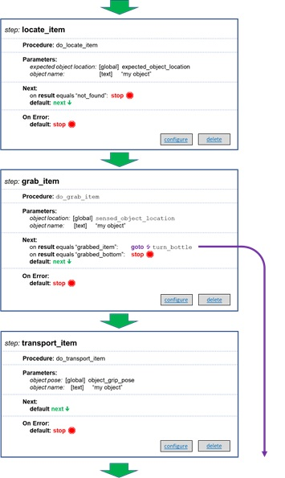

# Python Restricted Industrial (PyRI) Open Source Teach Pendant Programming Environment Software Architecture

*Version 0.1*

Last Updated: June 30, 2020

John Wason, Ph.D.
Owner, Wason Technology, LLC  
Visiting Researcher, Rensselaer Polytechnic Institute  

## Introduction

The open-source teach pendant is intended to provide a high-level
programming environment for use with open-source ecosystems like ROS and
Robot Raconteur. Developing software for robotics and automation using
these ecosystems is currently a difficult task, requiring significant
software development expertise. The open-source teach pendant will
abstract away the complexities of the open-source ecosystem, and present
the user with either a simplified Blockly or Python programming
environment. The Blockly or Python programs will interact with ROS
and/or Robot Raconteur through a series of plugins. These plugins will
encapsulate the complexity of these ecosystems and provide high-level
functionality. It is assumed that the user is familiar with using
complex computer software, but are not familiar with software
development. A good example of a target user is a person familiar with
computer strategy or sandbox games. This document provides an overview
of the user program composition and simplified software languages, the
user programming environment, the software architecture that implements
this programming environment, and how user software is executed.

# User Programs

“User Programs” refers to programs that are developed using the teach
pendant software. These programs are made up of the following
components:

- A top-level state machine that executes procedures and selects the
next state based on the output of the procedures
- A set of procedures developed using either Blockly or the Restricted
Python Dialect
- A set of reusable functions for Blockly or the Restricted Python
Dialect
- A set of global variables
  - May be generic data structures, or specific types such as Waypoints
  - May be constant, ephemeral, or persistent
  - Custom structure types can be defined by user
- A set of global parameters
- A group of plugins that implement additional functionality
  - Interact with hardware or provide advanced capabilities
  - Developed in normal Python 3.6 or greater
  - Can be individual instances of plugins and/or plugin factories
- A set of signals
  - Input, output, or both
  - Built in or provided by plugins
- Custom production interface panels for interacting with state
machine
- Notes and Documentation
- Resources, such as images, video, sounds, meshes, etc

# User Program State Machine

The top level of a user program is the state machine. State machines are
nearly always used as the high level construct for automation programs,
since the tasks being accomplished usually have a state-machine decision
structure.

Blockly and the Restricted Python Dialect do not have the inherent
ability to arbitrarily move to a different step in a procedure. This
type of behavior is typically implemented in C, C\#, Python, or other
programming language using a while loop with a switch statement. (In
Python, since there isn’t a switch statement, if/elif/else statements
are used.) Similar logic is implemented using classes and functions, but
the logic is generally very similar. Each step in the state machine is
selected with a case, and a variable is used to store the next desired
state. When a state change is needed, the desired state variable is set,
and the while loop is continued. The next iteration of the while loop
will select the desired case statement, and the execution will continue
at that state. The following is a simplified example of what a state
machine may look like in Python:

    while True:
        if state == 1:
            res = do\_something\_1()
            if res:
                state = 2:
                continue
            else:
                state = 3:
                continue
        elif state == 2:
            res = do\_something\_2()
            if res:
                state = 1
                continue
            else:
                state = 3
                continue
        elif state == 3:
            res = do\_something\_3()
            if res:
                state = 1
            elif
                raise Exception("Operation failed\!")
        else:
            raise Exception("Unknown state\!")

While this design is effective, it can be challenging to get right even
for experienced programmers.

The top level of a user program consists of a state machine with
multiple steps. Each step executes a procedure, and selects the next
state based on the result of the procedure. Procedures may be
implemented using Blockly, Restricted Python Dialect, or be plugin
functions. It is possible that many user programs will be able to be
developed as state machines without needing to implement any Restricted
Python Dialect or Blockly procedures. Each step is assigned a name, and
optionally a category.

Each step of the state machine will be able to pass parameters to and
execute a single procedure. The parameters may be global variables,
signals, or constants. These parameters are fixed to the specified
variable, signal, or constant. The state machine will then be able to
select the next state based on the result of the procedure. The state
machine itself will not have any logic available beyond selecting the
next state. This selection will be based either on a string returned by
the procedure on success, or the type of exception on failure. Steps may
also list which steps may or may not proceed the step.

The following is an example of what a few steps in a state machine may
look like:

The state machine is designed to allow for the user to arbitrarily jump
to a step of the program. The ability to jump around is possible because
of the global variable table and the state machine design. Since all the
current data is stored in the global variable table and not within the
steps, the steps can be executed in arbitrary order (within the
specified limits of the program) without losing data integrity.

The state machine is also designed to allow for the program to be
continued after the system has been power cycled. To accomplish this,
the state machine has four different modes:

- **Main:** The main program that executes the process
- **Startup:** Always called when the program is loaded regardless of main
- **Shutdown:** Always called when the program is unloaded regardless of main
- **Events:** Called when an event is generated. The event may be executed between steps, run concurrently to the current step, force a state change, or terminate the program

The startup and shutdown modes are used to initialize and shutdown the
runtime environment for the program. These modes should not accomplish
any physical task.

The event mode is called when a specific event occurs. Each event has
its own set of steps, and has the following dispatch modes:

- **Wait:** wait for the next step transition to occur
- **Concurrent:** run the event concurrently to the running step
- **Interrupt:** pause the current step until the event routine is complete

The event routine has the ability to modify global variables, force a
state change, or terminate the program. It should not attempt to send to
commands to devices or modify the environment directly.

# Procedures and Functions

User defined procedures are used to execute program logic. They are
called by the state-machine steps, or from other procedures/functions.
Procedures accept parameters, can read and write global variables, can
interact with plugins, can raise errors, and can specify a return value
string. The return value or exception is used to determine the next step
the state machine should execute. Procedures are not persisted between
system restarts. Any local data and stack information is lost when the
procedure is exited or aborted by a shutdown. Data that must be retained
should be stored in the global variable table.

Procedures are executed using a sandboxed Python execution environment.
This environment is configured to restrict the Python code to a subset
of standard Python and restrict access to the standard libraries. The
objective is to create a programming environment that is simple to
learn, easy to analyze, and limits malicious software. The full Python
environment is available using plugins, which can be called from the
restricted Python environment. It is expected that plugin developers
will have the experience to reliably use the full feature set of Python.
These plugins are then available to less skilled developers using the
teach pendant interface.

One option for creating the Python sandbox is the RestrictedPython
project \[1\]. This project restricts the execution of Python bytecode
to a subset of the standard Python capabilities. Sandboxing is a
difficult computer science problem and will require significantly more
work before it can be fully implemented. RestrictedPython can also
potentially be used to track and regulate the execution of Python
software by using the Python pdb debugger module. (Note that
RestrictedPython is a separate concept from the Restricted Python
Dialect that is being developed for this project.)

RestrictedPython uses “Policies” to decide what commands and syntax are
allowed. The teach pendant project will define a policy for use with
RestrictedPython. While the exact limitations are still being decided,
the following language features have currently been selected for
restriction:

- import (with pre-imported safe modules)
- file access
- classes
- metaclasses
- closure
- lambda
- function handles
- generators
- input
- threading
- selected builtins (allow builtins defined by RestrictedPython.safe\_bultins and RestrictedPython.limited\_builtins)

Simple utility libraries like the “Pure Python Linear Algebra” \[2\]
should be provided within the restricted Python environment. The exact
libraries that will be made available will be decided during the
development of the environment.

The exact feature set and limitations of the Restricted Python Dialect
will be discussed in a future document.

Procedures will always be “awaitable” functions, as defined by the
Python Coroutines and Tasks documentation \[3\]. Plugins will frequently
execute network commands, communicate with hardware, or execute a long
running operation. Without using “await”, the plugin would block the
main program thread.

Procedures may optionally be developed using Blockly instead of Python.
This may be an attractive option for users who are not experienced
programmers. Blockly and the closely related MIT Scratch visual
programming languages are very popular in education and are widely used
in primary and secondary schools. Programs written in Blockly are
compiled to Python for execution. To allow for more granular control,
Blockly has the option to insert prefixes before and after statements
\[2\]. This can be used to track and regulate the execution of the
Blockly programs. The following figures demonstrate this behavior.
(Blocks are assigned random strings as identifiers, as shown in the
\_\_begin\_blockly\_statement and \_\_end\_blockly\_statement Python
function calls.)

Functions are similar to Procedures but are not callable by steps. The
are intended to be called from other procedures and/or functions.
Functions may or may not be awaitable and may optionally return a value.
They may access global variables. They may interact with plugins but
must be marked as awaitable to do so.

Functions and Procedures that only use “const” operations on global
variables, plugins, and signals can be used as “const”.

Procedures and Functions are organized into modules containing one or
more procedure and/or function. This is similar to Python modules and
Blockly workspaces. Modules may not contain module level variables. All
global variables must use the global variable table.

The global variable container type is used to store structure types at
the local variable scope.

# Global Variables

Global variables exist at the top level of the user program, alongside
the state machine. The global variables are stored an a table that can
be edited by the user. These variables can have different types,
including taught waypoints.

Global variables can have one of three storage levels:

- **Constant:** Always the value set by the user
- **Ephemeral:** Deleted on program exit
- **Persistent:** Maintain the current value after program or system restarts. Optionally have a specified constant default value. May optionally be set to default value on program start

The global variable table can be “reset to default”, which immediately
deletes all ephemeral global variables and sets persistent variables to
default.

Global variables may be accessed and set by procedures, functions, and
plugins. Procedures, functions, and plugins may also create, delete, and
change the storage level of global variables.

Global variables must have an assigned type. This type must be
convertible to a Robot Raconteur structure. These types may be defined
by the teach pendant system, the user, or by plugins.

Global variables are stored in a Python container class. This container
class will be configurable and store all global variable types. There
are not individual Python classes for each variable type.

Reading a global variable is a “const” operation.

The user can modify global variables using a graphical user interface
editor. This editor is part of the teach pendant user interface. Each
variable type may optionally have a specialized editor. For example,
waypoints will have a specialized editor to allow for capturing
waypoints from a physical robot or using visualization. Plugins may
provide specialized editors.

Global variables may require scoping, depending on the complexity of
developed software.

# Global Parameters

Global parameters are similar to constant global variables but are
intended to be configured in the future. For example, the URL of a robot
may change. The global parameters are stored separately, so future users
know which settings should be changed. Automated configuration systems
can also interrogate and modify global parameters. Reading a global
parameter is a “const” operation.

# Plugins

Plugins are used to extend the functionality of the teach pendant
software. The built-in functionality of the teach pendant software will
be very limited, with the expectation that most of the functionality
will be made available through plugins.

Plugins may have the following contents

- A plugin factory that creates the other elements and contains metadata about the plugin
- Object that implement functionality and can be interacted with using the state machine, procedures, and functions
- Global variable types
- Global variables
- Global variable types editors
- Signal indicators/controls
- Plugin configuration editors
- User interface panels
- Widgets for custom production panels

Plugins must contain one plugin factory and may contain any combination
of the other elements.

The plugin factory is the entry point into the plugin, containing
metadata about the plugin contents and access to the other available
plugin contents. Plugins follow a similar design to Python Wheels \[5\],
with the addition of a plugin factory. (If possible, the plugins will be
distributed as Wheels.)

The plugin factory will contain the following metadata:

- Plugin name
- Version
- Summary
- Description
- Keywords
- Homepage
- Download-URL
- Author
- Author-email
- Maintainer
- Maintainer-email
- License
- UUID
- Project-URL
- Supported teach pendant software version
- Plugin components
  - Object names and descriptions
  - Global variables names and descriptions
  - Global variable types names and descriptions
  - Global variable types editors names and descriptions
  - Widgets names and descriptions
- Dependencies

Custom metadata is stored within the plugin using yaml or json. Plugins
can be detected using the pkg\_resources module included with setuptools
\[6\]. pkg\_resources finds all installed packages, and can retrieve the
plugin metadata files for the packages. These metadata files can then be
interrogated to find available plugins.

## Plugin Factories

The plugin factory will have a series of standard functions used to
instantiate the available contents. This instantiation can either be
done using the user program plugin configuration editor, or at runtime
using procedures and/or functions. The user program plugin configuration
editor will allow the user to select which plugins are in use, which of
the contents to instantiate, and the parameters to pass to the content
being instantiated. The plugin configuration editor instantiates the
plugins during the program startup phase, using the parameters
specified. Parameters can either be local constants, global constants,
or global parameters. If more control is needed, the plugin content can
be instantiated using commands in Python or Blockly.

## Plugin Objects

Plugin objects are the primary way that the teach pendant interacts with
the rest of the system and the outside world. The teach pendant is
“object-based”, similar to Visual Basic Script or other simplified
programming environment. The simplified programming languages can
consume objects but are not capable of defining object. For simplicity,
there is no concept of inheritance or polymorphism for plugin objects.

Plugin objects have the following member types:

- Properties – Properties that can be read or written, depending on behavior
- Procedures – As described in the Procedures and Functions section
- Functions – As described in the Procedures and Functions section
- Signals – Inputs and/or outputs
- Events – Events that trigger the state machine to enter an event state

Plugins are standard Python objects that extend from a master plugin
object base class. The member requests are proxied through dispatch
function, for example “get\_property”, “set\_property”, “call\_function”
etc. The user Python or Blockly are provided with a more intuitive
version that has standard property and function access. The exact design
for these proxy interfaces is currently not defined. The member
operations will be marked as “const” if they can be safely called
without changing the object state. Dispatch functions are always
“awaitable” Python function. This is done to prevent blocking of the
main thread.

The plugin objects will be accessed from Blockly using dispatch
functions, which take the plugin and the name of the member as
arguments. Optionally, the plugin may provide custom Blockly blocks for
display in the palette. The existence of these custom blocks is
specified in the plugin metadata, and the js and json files that define
the custom blocks are included in the plugin wheel.

Plugins are instantiated using the plugin factory. The existence of the
object type and a description is included in the plugin metadata.

Conceptually, each physical or logical device being used by the teach
pendant will have a plugin object representing it.

## Global Variable Types

Custom global variable types can be defined in plugins. These global
variable types must be compatible with Robot Raconteur structure types.
These types can be used in the global variable table, in user defined
Python or Blockly, or in the plugins.

The available custom global variable types are defined in the plugin
metadata.

## Global Variables

Some plugins may require specific global variables. These can be
specified by the plugin in the plugin metadata. The global variable
type, name, and storage type are specified.

## Global Variable Type Editors

Variable types may have specific behavior. Custom variable editors can
be specified in the plugin metadata, with the html, js, and json files
required to implement the custom editor included in the python wheel.

## Signal Indicators and Controls

Some signals may have special behavior that is better served by a custom
indicator or control. Plugin provided signal indicators/controls can be
specified in the plugin metadata, with the html, js, and json files
required to implement the custom editor included in the python wheel.

## Plugin Configuration Editors

Plugins may need special configuration steps, such as connection to a
robot and reading parameters. For this reasons, plugins may provide
custom configuration editors that implement extra logic. These editors
will run entirely within the user interface and be developed in html,
js, and json. These files are contained in the Python Wheel, and the
custom editor is specified in the plugin metadata.

## User Interface Panels

Plugins may need to add additional panels to the user interface. For
instance, a plugin representing a robot may need to add a jog panel, or
a PLC may need to add a panel to change signal values. These panels will
run within the user interface, and be developed in html, js, and json.
These files are contained in the Python Wheel, and the custom editor is
specified in the plugin metadata.

These panels will either be independent of the currently running user
program or will interact with the currently loaded user program. The
behavior of these panels is left to the plugin author.

## Custom Panel Widgets

Custom panel widgets can be included in the plugin. These widgets are
used on user defined panels. Custom widgets can be specified in the
plugin metadata, with the html, js, and json files required to implement
the custom editor included in the python wheel.

# Signals

Signals are used to communicate with outside devices and logical
devices. Signals are often implemented as a digital or analog wire
connected to a device. This wire can be an input, an output, or both.
Signal are implemented in Robot Raconteur using the “wire” member, and
signals in the teach pendant will have similar behavior to Robot
Raconteur wires.

In the teach pendant, signals are either built into the core software,
or provided by plugins. Almost all signals will be provided by plugins.
The global symbols are provided by global plugin objects that have been
configured by the user using the global plugin configuration editor.
Once a plugin object has been configured, the signal provided by that
object are made available in the global signal editor. These signals can
be configured for use by the user software, other plugins, for the
custom user panel, or set to trigger an event.

Signals can be read and written from procedures, functions, and plugins.
They can be used to generate events and can be displayed on user panels.

Reading a signal is a “const” operation.

# Custom User Interface Panels

A user interface panel editor will be available for building production
time panels. These panels will be used when the automation system is
running in production mode, after programming is complete. It is assumed
that the users during production are not engineers but are rather
workers trained to operate the automation system. These production user
interface panels must be very simple and intuitive, giving the minimal
amount of information and control required to operate the system.

The panel editor will prevent a blank panel and a palette of widgets to
place on the panel. The widgets will either be built into the core teach
pendant software or provided by plugins. The widgets will either be
indicators or controls. For indicators, the widget will display a global
variable, or the output of a function. This function will be defined in
user Python, Blockly, or a plugin. (All operations must be “const”.) It
will be called every screen update. For the controls, the widget will
set a global variable and or trigger an event. Because of the
asynchronous nature of panel input, they cannot safely call procedures,
functions, or plugins.

Custom user interface panels will be capable

# Notes and Documentation

Notes and documentation creation will be integrated into the user
program editor. These files will be Markdown.

# User Program Save File Format

The user programs and associated data like variables, parameters, and
plugin configuration are saved to disk for permanent storage. The file
formats and directory structures will be designed to be stored on GitHub
or other git repository. For this reason, all file formats must be plain
text. The exception is resource files which may be binary. These
resources are not directly edited or maintained by the teach pendant. It
is expected that the files will consist of the following formats:

- Python Code
- XML
- YAML
- JSON
- Markdown
- Resources buckets, possibly binary

The programs will follow the conventional Git directory structure, with
the following contents:

- License file
- README.md file
- .gitignore file
- src/ directory, containing python and blockly code
- docs/ directory, containing notes taken
- config/ directory, containing default parameters, global variable default names and variables, and plugin configuration
- state/ directory, containing the current global variable table, current execution state, current signal values, and current plugin configuration. This will normally be set to “ignore” since it is not directly transferable to other users.
- resources/ directory, containing binary resources used by the program
- panels/ directory, containing user defined panels

The teach pendant software will use git internally to manage and version
control software being developed by users. User programs can be
distributed using GitHub and similar repositories. A marketplace can
potentially be set up that tracks the available plugins and
automatically installs them from GitHub.

Plugins will be stored in Python Wheel format. These wheels must have
the correct metadata file for the teach pendant. There are no specific
requirements for plugin file formats beyond these two requirements.

# User Program Runtime Environment

The teach pendant system is broken up into two separate computing units:
the teach pendant (or laptop) which serves as the programming user
interface, and a runtime computer that stores and executes the programs.
The runtime computer interfaces with the user interface through a
“program manager”. This manager maintains a connection with the user
interface, manages the program files, starts user programs, and manages
the lifecyle of the running user programs. The user programs themselves
run in a separate process. The plugins are loaded into the user process,
meaning they have the same lifecycle as the user program. The user
program processes will have some level of sandboxing to prevent damage
to the rest of the system from errant programs. This sandboxing may
consist of restricting the allowed commands by the user software,
running the user process in a chroot environment, running in a
container, and/or some other method to be determined in the future.

The operation of the teach pendant will be logged, with different levels
of logging set by the user. Plugins may optionally send logging
information to the teach pendant logging system.

# User Program Editor

The user program editor is an IDE designed for editing user programs.
The user program editor may optionally be extended with additional
panels by the plugin to implement specialized functionality, like robot
jogging, variable editing, plugin object configuration, etc.

The user program editor will be implemented entirely in HTML, CSS,
JavaScript, and other web browser compatible technologies like
WebAssembly. This design choice will result in software that is fully
portable between clients and can be provided over the network without
requiring installation. (JavaScript here includes compile-to-JavaScript
technologies like TypeScript and Bridge.NET.) Pyodide \[7\] is a
potential option for a programming environment, allowing full a Python
runtime within the browser. Unfortunately, the performance has been
uninspiring compared to the JavaScript based options, so it is not
currently being considered. Improving the performance of Pyodide will be
investigated to determine if it is a feasible option.

The user program editor will have, at minimum, the following panels:

- Top-level (independent of active user program)
  - Welcome screen
  - Help Navigator
  - User Program Manager/File Explorer
  - Plugin manager
  - System configuration
  - Diagnostics
  - About page
  - System manager/software update
  - Login and user manager
  - Panels provided by plugins
- User Program Panels
  - Program metadata panel
  - Documentation editor
  - State machine editor
    - Sub-editors for main, startup, shutdown, and events
  - Procedure and Function editor
    - Python editor (with linting if possible)
    - Blockly editor
  - Parameters editor
    - Plugin provided parameter editor panels
  - Global variable editor
    - Plugin provided global variable editor panels
  - Signal configuration editor
    - Plugin provided signal indicators/controls
  - Plugin configuration editor
    - Plugin provided specialized configuration panels
  - Custom production panel editor
  - Standard production window
  - Plugin provided panels
  - Log viewer
- Production mode panels
  - Standard production panel
  - Custom production panels provided by user program
  - Diagnostics screen
  - Production mode documentation from user program
  - Log viewer

The user program editor may optionally be integrated into another
existing IDE. A compelling option is to integrate the teach pendant
programming user interface into Visual Studio Code \[8\] or the closely
related Eclipse Theia \[9\]. Visual Studio Code is an IDE developed by
Microsoft that uses Electron \[9\] as its runtime environment. Electron
is based on Google Chromium \[10\], and is essentially a web browser
operating as a standard application.

Visual Studio Code is highly customizable using extensions. The teach
pendant can implement custom Side Bars (B), Editors (C), and Panels (D).
Extensions can use the “Webview API” \[12\], allowing what are
essentially normal web pages to be displayed in an editor or other
panels. This provides an easy way to integrate the teach pendant panels
into Visual Studio Code.

Visual Studio Code has the disadvantage that it is an installed program
and cannot be served from a web server without installation. Eclipse
Theia is a closely related project, originally based on Visual Studio
Code, that can be served from a web server. It has support for Visual
Studio Code extensions, which avoids the installation problem.

Using an existing IDE like Visual Studio Code is desirable because it
already has significant functionality, and a large user base. Many of
the basic issues of developing an IDE like window layout, version
control integration, syntax highlighting, etc, are already implemented.
Being an extension to an existing editor also makes it more approachable
for the programming community.

The primary challenges with Visual Studio Code and Eclipse Theia are the
lack of touch screen support, and the design of remote extension
communication.

Visual Studio Code and Theia use a layout that is not touch-screen
friendly. The user interface is also far too busy for use by novice
programmers. The user interface would need to be customized to reduce
the clutter, and adjust the arrangement of elements for use with a
touchscreen. While it may be possible to achieve these modifications
with extensions alone, fully changing the layout may require patching
the source code of the IDEs. Whether or not this is worth the effort is
yet to be determined.

Visual Studio Code and Theia have the concept of “remote extensions”,
where the user interface part of the extensions runs in the editor,
while a server on a remote machine runs the backend part of the
extension. Visual Studio Code uses SSH and/or sockets to achieve this
communication with a proprietary protocol, while Theia uses Json RPC. It
is unclear if this design of remote communication is compatible with the
architecture of the teach pendant, or if it is feasible to implement an
option that is compatible.

Deciding if it makes sense to integrate with Visual Studio Code or Theia
will require further research and experimentation.

The design of the program editor should attempt to borrow concepts from
the computer gaming industry to make programming easier and more
familiar to users.

# References

\[1\] "RestrictedPython," 2019. \[Online\]. Available:
https://github.com/zopefoundation/RestrictedPython. \[Accessed 8 1
2020\].

\[2\] "Pure Python Linear Algebra," \[Online\]. Available:
https://github.com/dmishin/pyla. \[Accessed 8 1 2020\].

\[3\] "Coroutines
and Tasks," \[Online\]. Available:
https://docs.python.org/3/library/asyncio-task.html. \[Accessed 8 1
2020\].

\[4\] "Bolckly.Generator," \[Online\]. Available:
https://developers.google.com/blockly/reference/js/Blockly.Generator.
\[Accessed 8 1 2020\].

\[5\] "Python Wheels," \[Online\]. Available:
https://pythonwheels.com/. \[Accessed 9 1 2020\].

\[6\] "Package
Discovery and Resource Access using pkg\_resources," \[Online\].
Available:
https://setuptools.readthedocs.io/en/latest/pkg\_resources.html.
\[Accessed 9 1 2020\].

\[7\] "Pyodide: The Python scientific stack,
compiled to WebAssembly," \[Online\]. Available:
https://github.com/iodide-project/pyodide. \[Accessed 9 1 2020\].

\[8\]
"Visual Studio Code," \[Online\]. Available:
https://code.visualstudio.com/. \[Accessed 9 1 2020\].

\[9\] "Theia:
Cloud & Desktop IDE," \[Online\]. Available: https://theia-ide.org/.
\[Accessed 9 1 2020\].

\[10\] "Electron," \[Online\]. Available:
https://electronjs.org/. \[Accessed 9 1 2020\].

\[11\] "The Chromium
Project," \[Online\]. Available: https://www.chromium.org/. \[Accessed 9
1 2020\].

\[12\] "Visual Studio Code: User Interface," \[Online\].
Available: https://code.visualstudio.com/docs/getstarted/userinterface.
\[Accessed 9 1 2020\].

\[13\] "Visual Studio Code: Webview API,"
\[Online\]. Available:
https://code.visualstudio.com/api/extension-guides/webview. \[Accessed 9
1 2020\].

\[14\] "setuptools-meta," \[Online\]. Available:
https://github.com/noirbizarre/setuptools-meta. \[Accessed 9 1 2020\].
