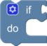
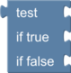

# Standard Blockly Blocks

Blockly comes with many standard blocks. The teach pendant uses most of these standard blocks. These blocks generate Python directly, and do not use any of the "sandbox functions" that are used with PyRI specific blocks, discussed in other sections.

See the Blockly documentation at https://developers.google.com/blockly and https://blockly.games/ for more information on Blockly, and some learning tools. Scratch (https://scratch.mit.edu/), a visual programming educational tool developed by MIT, uses blocks very similar to the teach pendant. It may be a useful learning tool for those who are not familiar with programming or block based visual programming.

The standard Blockly blocks are organized into the following categories:

* Logic
* Loops
* Math
* Lists
* Text
* Variables

The rest of this document will present and discuss each available block.

## Logic/If Blocks

### If

The "If" block is used for if/then/else statements. Click the gear icon to customize the form of the block.

## Logic/Boolean

### Comparison

Compare two values. Supports "equals", "not equals", "less than", "less than or equal", "greater than", "and greater than or equal" operators.

### Logic Operation

Logical operation on two booleans. Supports "and" and "or" operations.

### Not

Boolean "not" operator.

### Boolean Constant

Returns "true" or "false" constant.

### Null Constant

Return "null" constant. (`None` in Python)

### Logic Ternary

Logic ternary operation. Similar to question mark operator in C, Java, C\#, and JavaScript.

## Loops

### Repeat

Repeat a section a specified number of times.

### Repeat While

Repeat a section "while" a value is "true", or "until" a value is "true".

### For Loop

For loop, counts "i" from start to end, by a specified increment.

### For Each

Run section for each value in specified list. "i" will hold the value for each iteration.

### Break/Continue

Break out of current loop, or continue to next iteration of loop.

## Math

### Number Literal

Enter a literal number value.

### Arithmetic

Arithmetic operation block. Supports "add", "subtract", "multiply", "divide", and "exponent".

### Unary Operations

Unary mathematical operators. Supports "square root", "absolute", "negative", "natural log", "log10", "natural exponential", and "base 10 exponential"

### Trigonometric Functions

Trigonometric functions. Supports "sin", "cos", "tan", "asin", "acos", and "atan". Angles are specified in degrees.

### Numeric Constants

Numeric constants. Supports "pi", "Euler's number", "golden ratio (phi)", "sqrt(2)", "sqrt(1/2)", and "infinity".

### Property of Number

Check if a number has a certain property. Supported checks are "even", "odd", "prime", "whole", "positive", "negative", or "divisible by".

### Round

Round a number. Supports "round" , "round up", and "round down".

### List Operation

Perform operations on a list. Supports "list sum", "list min", "list max", "list average", "list median", "list modes", "list standard deviation", and "random item".

### Remainder (Modulo)

Find the remainder of a division operation. Also called the "modulo" operator.

### Constrain

Constrain a value between a low and high value.

### Random Integer

Return a random integer in the specified range.

### Random Fraction

Return a random real number between 0 and 1.

### atan2

atan2 operator. Returns result in degrees.

## Lists

### Create Empty List

Returns a new empty list.

### Create List With

Create a list with specified items. Click gear icon to modify number of initial items.

### Create Repeat

Create a list by repeating the same item the specified number of times.

### List Length

Return the length of the list as a number.

### Is Empty

Check if list is empty. Returns boolean result.

### List Find Value

Return the index of the first instance of the specified item.

### List Get Item

Get the item at specified location.

### List Set Item

Set the item at specified location.

## Text

### String Literal

Enter a string literal. Do not include quotes.

### String Length

Return the length of a string.

### Print

Print a string or other value to the output. This output will be visible in the "Output" window of the teach pendant WebUI.

## Variables

Local variables can be created using the "Create variable..." button in the "Variables" toolbox category.

Variables can be "set" and read using the blocks dynamically generated by the "Create variable..." button.