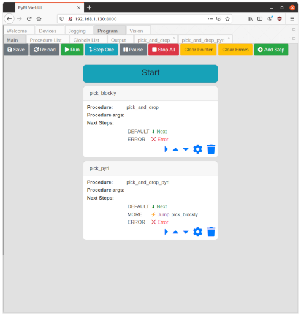

# User Programming Guide

## Introduction

User programs are software developed using the Teach Pendant user interface, and executed by the runtime environment. These programs are stored in a database, which normally is saved as a file. The save file location is specified when `pyri-core` is started using the `--db-file=` command line option.

User programs are made up of the following components:

- A top-level state machine that executes procedures and selects the
next state based on the output of the procedures
- Procedures developed using either Blockly or PyRI
- Global variables stored in a central table

The program is developed using sub-panels under the "Program" tab of the WebUI.

## Startup

The teach pendant is typically started using a Conda environment. See the README.md for instructions on Conda installation. Run the following commands in a Miniconda environment:

```
conda activate pyri
pyri-core --db-file=my_project.db
```

Where `my_project.db` is the filename to save the project.

Once `pyri-core` is running, open a Firefox or Chrome browser to http://localhost:8000 to open the WebUI.

## Main State Machine

The top level of a user program is the state machine. State machines are
nearly always used as the high level construct for automation programs,
since the tasks being accomplished usually have a state-machine decision
structure.

The state machine contains
multiple steps. Each step executes a procedure, and selects the next
state based on the result of the procedure. Procedures may be
implemented using Blockly or the Restricted Python Dialect.
Each step is assigned a name.

Each step of the state machine is able to execute and pass parameters
to a single procedure. The parameters are plain strings passed
to the procedure. The state machine is able to
select the next state based on the result of the procedure. The state
machine itself does not have any logic available beyond selecting the
next state. This selection will be based either on a string returned by
the procedure on success, or the type of exception on failure.

The following is a screenshot state machine in the editor panel in the
WebUI:



The toolbar has the following buttons:

* **Save**: Save the current state machine. Save must be clicked before "Run".
* **Reload**: Reload the state machine from the database. This must be clicked when the WebUI is loaded, since it is not loaded automatically.
* **Run**: Run the current state machine from the current step. The current step will be highlighted in Blue, Green, or Yellow. If the highlight is Red, an error has occurred, and must be cleared before running again.
* **Step One**: Run a single step, and then pause.
* **Pause**: Pause the execution after completing the current procedure.
* **Stop All**: Stop the state machine and abort the current procedure.
* **Clear Pointer**: Clear the state machine execution pointer. This will cause the state machine to start from the beginning.
* **Clear Errors**: Clear any errors. This will also clear the execution pointer.
* **Add Step**: Add a new step to the end of the state machine.

The steps of the state machine are listed below the toolbar. The header of the active step or the "Start" bar will be highlighted when it is currently selected, with a color to report the current action. The highlight may be one of the following colors:

* **Green**: The procedure is being executed
* **Yellow**: The program is stopped, and will resume with this step
* **Blue**: The program is paused, and will resume with this step
* **Red**: This step caused an error. The error must be cleared before execution can be resumed

Each step is represented by a card with the following contents:

* **Name**: The name of the step is shown in the title bar, which is highlighted when the step is active
* **Procedure**: The name of the procedure this step executes
* **Procedure Args**: The list of string arguments that are passed to the procedure
* **Next Steps**: The next step that will be executed based on the result of the step
* **Actions**: A set of icons that can be clicked to execute an action
  * **Move Pointer to Step** (Right Arrow): Move the execution pointer to the current step. Execution must be paused or stopped first.
  * **Move Step Up** (Up Arrow): Move step up in the step list
  * **Move Step Down** (Down Arrow): Move step down in the step list
  * **Edit Step** (Gear): Edit the step
  * **Delete Step** (Trash): Delete the step

The "next steps" section controls the logic of the state machine. Procedures set a "result" string, which is a case insensitive string that is set using the `proc_result_set()` Blockly block or sandbox function. (This block is in the Util toolbox category in the Blockly editor.) By default, the result string is "DEFAULT" if the procedure succeeds, and "ERROR" if it fails. By default, the state machine will execute the next step on success, and raise an error and stop execution on failure.

The state machine may take the following actions based on the result of the step:

| Action | Description |
| ---     | ---         |
| `Stop`  | Stop execution of state machine after current step without error |
| `Next`  | Continue to the next step |
| `Jump`  | Jump to a specified step |
| `Error` | Stop execution of state machine and set error state |

The step editor is opened by clicking the "Add Step" toolbar button, or clicking the gear icon to edit an existing step. The following is an example screenshot of the step editor:


The editor has the following input fields:

* **Step Name**: The name of the step
* **Procedure Name**: The name of the procedure to execute
* **Procedure Args**: The string arguments to pass to the procedure, one per line
* **Next Steps**: The next steps commands based on procedure result, one per line.

The **Next Steps** are entered as a simple program, with one step per line. Each line has the following format:

```
PROCEDURE_RESULT_STRING OP <JUMP_TARGET>
```

The `PROCEDURE_RESULT_STRING` should be replaced with the expected procedure result. The special results strings `DEFAULT` is used for the default result, and if no other result matches. `ERROR` is used if the procedure raises an error. The four operations allowed are `stop`, `next`, `jump`, and `error`, as shown in the above table. The `jump` command has three words on the line, with the last work being the name of the step to jump to.

The example in the screenshot has the following next steps program:

```
DEFAULT next
MORE jump pick_blockly
ERROR error
```

This simple program will move to the next step by default, jump to the `pick_blockly` step if `MORE` is the result, or raise an error if the procedure returns an error.

## Procedures

Procedures are the primary programming method for the teach pendant. They can be developed using Blockly visual programming, or using the Restricted Python Dialect. The Restricted Python Dialect is a subset of the standard Python programming language that has been simplified for industrial use, and runs in a protected sandbox. Procedures are ephemeral, and do not persist data between execution. All data and variables that need to be stored are kept in the global variable table. The core teach pendant software and plugins provide additional blocks and functions for interacting with devices and for computations. See [Blocks and Sandbox Functions Reference](#blocks-and-sandbox-functions-reference) for more information on these additional functions.

Procedures are created and accessed using the Program -> Procedures panel in the WebUI. An example screenshot of this sub-panel:


The toolbar has the following buttons:

* **Refresh Table**: Refresh the table of procedures. This must be clicked when starting the WebUI. It is not refreshed automatically.
* **Delete Selected**: Delete all selected (checked) procedures
* **New Blockly**: Create a new Blockly procedure
* **New PyRI**: Create a new PyRI procedure
* **Stop All:**: Stop all procedures

The procedure list displays information about the procedure. The icons can be clicked for the following actions:

* **Run** (Play icon): Execute the procedure
* **Open** (Open icon): Open the procedure. This will open a new sub-panel for either Blockly or Pyri
* **Copy** (Copy icon): Copy the procedure with a new name
* **Info** (Info icon): Display information about the procedure
* **Delete** (Trash icon): Delete the procedure

### Blockly Procedure Editor

The Blockly procedure editor is opened by clicking "New Blockly" or opening an existing Blockly procedure from the procedure list. A screenshot of a simple "Hello World" Blockly procedure:


This procedure will print "Hello World!" to the Program -> Output panel.

The Blockly editor has the following toolbar buttons:

* **Save**: Save the procedure to the program database. Save must be clicked before running the procedure.
* **Run**: Run the procedure with no arguments
* **Stop All**: Stop all running procedures

The Blockly workspace editor is a standard editor. The toolbox on the left side can be used to add blocks. [Blocks and Sandbox Functions Reference](#blocks-and-sandbox-functions-reference) for information on the available blocks. The (+) and (-) buttons on the lower right are used to change the zoom level. Drag blocks to the Trashcan icon to delete.

See the Blockly documentation at https://developers.google.com/blockly and https://blockly.games/ for more information on Blockly, and some learning tools. Scratch (https://scratch.mit.edu/), a visual programming educational tool developed by MIT, uses blocks very similar to the teach pendant. It may be a useful learning tool for those who are not familiar with programming or block based visual programming.

All blockly blocks must be inside the purple Procedure block that is automatically created with the procedure. **The name of the procedure MUST match the name in the procedure block**.

See [Examples](#examples) for examples of Blockly procedures.

### PyRI Procedure Editor

The PyRI procedure editor is opened by clicking "New PyRI" or opening an existing PyRI procedure from the procedure list. PyRI is short for Python Restricted Industrial, and is the simplified Python dialect used for developing procedures. The objective of PyRI is to simplify Python for novice users, and to make it safer and more verifiable for industrial applications. The full technical definition of PyRI is complex, and can be found in [pyri_dialect_specification.md](pyri_dialect_specification.md). The short explanation is that PyRI has the following restrictions:

* Classes and metaclasses are not allowed
* All code must exist in the single procedure function. Inner functions and lambda functions not allowed
* `eval` and `exec` are not allowed
* Imports are not allowed, and most of the standard library including file handling are not allowed
* Comprehensions are not allowed
* Yield, asinc, and generators are denied
* Global, local, and non-local are denied. Use the global variable sandbox functions
* Global module scope are denied
* Functions are added to the execution sandbox using "sandbox functions", which are provided by PyRI plugins. See [Blocks and Sandbox Functions Reference](#blocks-and-sandbox-functions-reference) for a reference on the available sandbox functions.

PyRI is intended to reduce the complexity of Python down to a simple scripting language, while still having it seem natural to existing Python programmers. For complex functions that require more capability than is allowed in the sandbox, it is recommended that sandbox function plugins be developed. See [plugin_development.md](plugin_development.md) for information on developing plugins.

A screenshot of a simple "Hello World" Blockly procedure:


The toolbar for the PyRI editor has two sections. The top row has the same buttons as the Blockly editor, while the rest of the buttons are soft-keys for the text editor. These additional soft-keys are intended for use on a tablet where a full keyboard and mouse are not available.

The top toolbar row has the following buttons:

* **Save**: Save the procedure to the program database. Save must be clicked before running the procedure.
* **Run**: Run the procedure with no arguments
* **Stop All**: Stop all running procedures

The editor soft-keys toolbar has the following buttons:

* **Left**: Move the cursor left
* **Right**: Move the cursor right
* **Up**: Move the cursor up one line
* **Down**: Move the cursor down one line
* **Home**: Move the cursor to the beginning of the current line
* **End**: Move the cursor to the end of the current line
* **Outdent**: Outdent the current line four spaces
* **Indent**: Indent the current line four spaces
* **Line Up**: Move the current line up one row
* **Line Down**: Move the current line down one row
* **Newline**: Insert a newline at the cursor
* **Select More**: "Smart Select" more at the cursor location
* **Select Less**: "Smart Select" less at the cursor location
* **Backspace**: Backspace delete at the cursor
* **Delete**: Delete at the cursor
* **Delete Line**: Delete the current line
* **Comment**: Comment the current line
* **Uncomment**: Uncomment the current line
* **Find**: Open the find dialog
* **Replace**: Open the find/replace dialog
* **Go To Line**: Jump to a line number
* **Undo**: Text editor undo
* **Redo**: Text editor redo
* **Insert Function**: Open the "Insert Function" dialog to insert a sandbox function

The "Insert Function" button will open the "Insert Function" dialog box. This dialog shows a list of sandbox functions that are available for use, and displays their help docstrings. These are provided by the core teach pendant software and by plugins, such as `pyri-robotics` and `pyri-vision`. The function will be inserted at the current cursor location. A screenshot of the "Insert Function" dialog:


All Python code must be inside a single function. **This function MUST have the same name as the procedure**. Parameters may be added to the function. The value of these parameters is set using the state machine step editor.

See [Examples](#examples) for examples of Blockly procedures.

## Examples

* Hello World Example Procedure: [hello_world_example.md](hello_world_example.md)
* Taught Pick and Place Procedure: [pick_and_place_example.md](pick_and_place_example.md)

## Blocks and Sandbox Functions Reference

* Standard Blockly Blocks: [standard_blocks.md](standard_blocks.md)
* Util: [util_blocks_functions.md](util_blocks_functions.md)
* Globals: [globals_blocks_functions.md](globals_blocks_functions.md)
* Time: [time_blocks_functions.md](time_blocks_functions.md)
* Linalg: [linalg_blocks_functions.md](linalg_blocks_functions.md)
* Geometry: [geometry_blocks_functions.md](geometry_blocks_functions.md)

The commonly used `pyri-robotics` and `pyri-vision` packages provide the following categories:

* Robotics: [robot_blocks_functions.md](https://github.com/pyri-project/pyri-robotics/blob/master/doc/robot_blocks_functions.md)
* Vision: [vision_blocks_functions.md](https://github.com/pyri-project/pyri-vision/blob/master/doc/vision_blocks_functions.md)