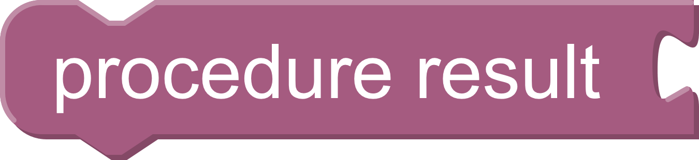

# Utility Blocks and Sandbox Functions

"Util" section in the Blockly toolbox. These functions and blocks are provided by the `pyri-common` package.

## proc_result_get

    proc_result_get()

Return the current procedure result. This result is used
by the main program state machine to determine the next step.

Return (str): The current result. Default is `DEFAULT`

## proc_result_set

    proc_result_set(result)

Set the current procedure result. This result is used
by the main program state machine to determine the next step.

Parameters:

* result (str): The new procedure result